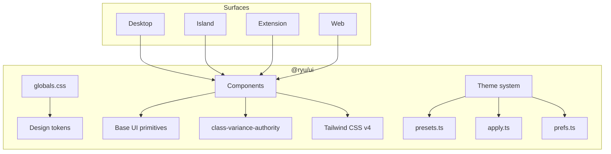

`@ryu/ui` is Ryu's shared design system package. Every Ryu surface — desktop, island, extension, web, TUI — imports from it, so any component you build with it will look and behave consistently across the platform.

## What's inside

| Layer | What it provides | Import |
|---|---|---|
| **Design tokens** | OKLCH color primitives, radius, animation timing, font stacks | `@ryu/ui/globals.css` |
| **Components** | 66+ React components (buttons, dialogs, data grids, editors, charts, chat bubbles, …) | `@ryu/ui/components/*` |
| **Hooks** | 16 reusable hooks (data grid, debounce, file upload, proximity hover, …) | `@ryu/ui/hooks/*` |
| **Theme system** | 30+ presets (Ryu, Codex, Claude, Catppuccin, GitHub, Linear, Raycast, …) with runtime switching | `@ryu/ui/theme/*` |
| **Utilities** | `cn()` class merge, spring tokens, suggestion variants, font weights | `@ryu/ui/lib/*` |
| **Editor** | Vendored PlateJS v53 with 45+ plugin kits and 80+ editor UI components | `@ryu/ui/components/editor/*` |
| **Data grid** | TanStack Table + Virtual with cell variants, presence, search, context menus | `@ryu/ui/components/data-grid/*` |

## Architecture



## Design principles

1. **Base UI, not Radix.** All interactive primitives use `@base-ui/react` for accessibility and behavior. Tailwind CSS v4 + shadcn patterns handle styling.
2. **OKLCH everywhere.** Color tokens use the OKLCH color space for perceptually uniform light/dark theming and 30+ runtime-switchable presets.
3. **CVA for variants.** Every component uses `class-variance-authority` for type-safe variant definitions. The `buttonVariants` export pattern lets you use component styles without the component itself.
4. **`cn()` for class merging.** The `cn()` utility (clsx + tailwind-merge) is the standard way to merge conditional classes.
5. **Motion by default.** Animation tokens are CSS custom properties with `prefers-reduced-motion` support. The `motion` library handles complex animations.

## Where it lives

```
packages/ui/
├── src/
│   ├── styles/globals.css      # Design tokens + Tailwind config
│   ├── theme/                   # Presets, apply engine, prefs
│   ├── components/              # 66+ React components
│   │   ├── editor/              # PlateJS editor (80+ sub-components)
│   │   ├── data-grid/           # TanStack Table grid (10 components)
│   │   └── *.tsx                # Standalone components
│   ├── hooks/                   # 16 reusable hooks
│   ├── lib/                     # Utilities, springs, transforms
│   └── types/                   # Shared TypeScript types
├── components.json              # shadcn config
└── package.json
```
