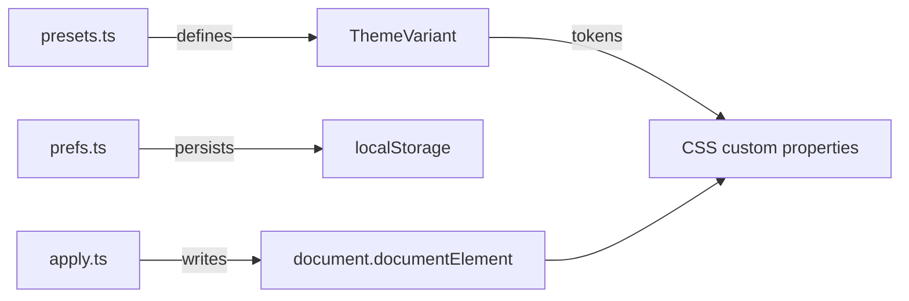

The theme system lets any Ryu surface switch between 30+ visual themes at runtime. Every theme is a set of CSS custom properties that override the design tokens, so components theme themselves automatically.

## Architecture



Three files, three responsibilities:

| File | Role | Import |
|---|---|---|
| `presets.ts` | Pure data: 30+ ThemeVariant objects with token maps. No DOM. | `@ryu/ui/theme/presets` |
| `apply.ts` | DOM engine: writes tokens to `<html>`, applies contrast curves, radius, fonts. | `@ryu/ui/theme/apply` |
| `prefs.ts` | Persistence: reads/writes ThemePrefs to localStorage. | `@ryu/ui/theme/prefs` |

## Available presets

### Ryu (default)

| Preset ID | Mode | Description |
|---|---|---|
| `ryu-light` | Light | The default Ryu light theme |
| `ryu-light-mono` | Light | Ryu light with monochrome accents |
| `ryu-dark` | Dark | The default Ryu dark theme |
| `ryu-dark-mono` | Dark | Ryu dark with monochrome accents |

### Third-party themes

| Theme | Light | Dark |
|---|---|---|
| **Codex** | `codex-light` | `codex-dark` |
| **Claude** | `claude-light` | `claude-dark` |
| **Ayu** | `ayu-light` | `ayu-dark` |
| **Catppuccin** | `catppuccin-light` | `catppuccin-dark` |
| **Dracula** | `dracula-light` | `dracula-dark` |
| **GitHub** | `github-light` | `github-dark` |
| **Linear** | `linear-light` | `linear-dark` |
| **Nord** | `nord-light` | `nord-dark` |
| **Notion** | `notion-light` | `notion-dark` |
| **One** | `one-light` | `one-dark` |
| **Raycast** | `raycast-light` | `raycast-dark` |
| **Tokyo Night** | `tokyo-night-light` | `tokyo-night-dark` |
| **Slate** | `slate-light` | `slate-dark` |
| **Stone** | `stone-light` | `stone-dark` |
| **Gray** | `gray-light` | `gray-dark` |
| **Red** | `red-light` | `red-dark` |
| **Rose** | `rose-light` | `rose-dark` |
| **Orange** | `orange-light` | `orange-dark` |
| **Green** | `green-light` | `green-dark` |
| **Blue** | `blue-light` | `blue-dark` |
| **Violet** | `violet-light` | `violet-dark` |
| **AMOLED** | (none) | `amoled-dark` |

## ThemeVariant structure

Each preset is a `ThemeVariant` object:

```typescript
interface ThemeVariant {
  id: string;           // e.g. "ryu-dark"
  label: string;        // e.g. "Ryu Dark"
  mode: "light" | "dark";
  preview: {            // Color swatch for theme pickers
    bg: string;
    surface: string;
    primary: string;
    text: string;
  };
  tokens: Record<string, string>;  // CSS custom property overrides
}
```

## Applying a theme

Use the `apply` engine to write theme tokens to the DOM:

```tsx
import { applyVariant, applyRadius, applyFonts } from "@ryu/ui/theme/apply";
import { RYU_LIGHT } from "@ryu/ui/theme/presets";

// Apply a preset
applyVariant(RYU_LIGHT);

// Customize radius
applyRadius(0.625);

// Set fonts
applyFonts({ ui: "Inter", heading: "Geist", code: "JetBrains Mono" });
```

## Persisting preferences

The `prefs` module manages the `ThemePrefs` shape:

```typescript
interface ThemePrefs {
  mode: "light" | "dark" | "system";
  lightPreset: string;   // ThemeVariant id
  darkPreset: string;    // ThemeVariant id
  contrast: number;      // 0-100
  radius: number;        // px
  customThemes: ThemeVariant[];
  uiFont: string;
  headingFont: string;
  codeFont: string;
}
```

## Custom themes

You can create user-defined themes by building a `ThemeVariant` from custom tokens:

```tsx
import {
  customTokensToVariant,
  variantToCustomTokens,
} from "@ryu/ui/theme/presets";

// Convert a variant to editable tokens
const tokens = variantToCustomTokens(myVariant);

// Modify tokens
tokens["--primary"] = "oklch(0.5 0.2 250)";

// Convert back to a variant
const custom = customTokensToVariant("my-theme", "My Theme", "dark", tokens);
```

## Contrast curves

The apply engine supports a `contrast` parameter that adjusts muted colors around a 50 midpoint using `color-mix`. Higher contrast pushes muted foreground colors further from the background:

```tsx
import { applyContrastToMuted } from "@ryu/ui/theme/apply";

// Adjust muted color contrast (0-100)
applyContrastToMuted(60);
```

## Reduced motion

All animations respect `prefers-reduced-motion: reduce`. When the OS setting is enabled, CSS transitions and keyframe animations are disabled automatically via the global stylesheet.
