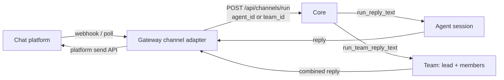

A channel bot turns a chat platform into a front door for Ryu. The Gateway runs the platform
listeners (`apps/gateway/src/channels/`); each inbound message is normalized and routed to a Core
agent or team, so a Telegram or Slack user talks to the same agent you talk to in the desktop, with
the same memory, tools, and Gateway governance on the path.

Channels are configured in **Gateway settings**, not on a Core node, and they are **account-global**.

## How a bot turn works

Each platform has an adapter (`telegram.rs`, `slack.rs`, `whatsapp.rs`, `discord.rs`) that normalizes
inbound deliveries to a `{chat id, text}` message. When the channel is bound to an agent or a team,
the adapter routes the turn through Core's session seam rather than a one-shot Gateway-pipeline call.

1. The platform delivers a message to the channel's adapter.
2. The adapter normalizes it and POSTs to `POST <core_url>/api/channels/run` with the channel's
   `agent_id` xor `team_id`. The sender id becomes the Core `conversation_id`, so every sender keeps
   a persistent conversation in `conversations.db`.
3. Core dispatches: a non-empty `team_id` invokes `run_team_reply_text` (the lead agent orchestrates
   members and returns one combined, attributed reply); otherwise `run_reply_text` runs the single
   agent. Both reuse the same ACP chat path, memory, and Gateway routing the desktop uses
   (`apps/core/src/sidecar/adapters/mod.rs`).
4. The model calls still flow Core to Gateway, so routing, firewall, budgets, and audit stay on the
   path.
5. The reply is sent back via the platform's send API.

A channel with neither `agent_id` nor `team_id` falls back to the legacy gateway-pipeline path (a
single non-streaming call with the channel's configured model and system prompt); the agent/team
seam is the recommended setup because it persists conversation history and reaches Core memory and
tools.

## Set up a bot

<TryInRyu page="channels" />

1. Get a bot token from the platform: a Telegram BotFather token, a Slack bot token, a WhatsApp
   Cloud API token, or a Discord bot token.
2. In the desktop, open **Gateway -> Channels** (`apps/desktop/src/components/gateway/ChannelsSection.tsx`,
   rendered inside `GatewayDialog.tsx`). You can also reach it from the command palette, a
   `ryu://...channels` deep link, or **Settings -> Advanced** - all open the dialog at the Channels
   section via the `useGatewayDialog` store.
3. Add a channel: pick the platform, paste the token, and set the **Routes to** target. The picker
   lists your agents and teams; a team is selected with a `team:` sentinel value and persisted as
   `teamId` (otherwise `agentId`) on the channel config.
4. Save. CRUD hits the control-plane server `:3000/api/channels` with a Better-Auth bearer; the
   Gateway listener then loads enabled channels from `/channels/gateway/enabled` and starts handling
   inbound messages.

For WhatsApp, front the webhook bind with a public HTTPS reverse proxy - Meta requires HTTPS for
webhook delivery (`apps/gateway/src/channels/whatsapp.rs`).

## Routing to an agent or a team

The **Routes to** picker decides what answers the bot:

| Target | Persisted field | Core dispatch | Reply shape |
|---|---|---|---|
| A single agent | `agentId` | `run_reply_text` | One agent reply |
| A team | `teamId` (`team:` sentinel) | `run_team_reply_text` | One combined, attributed reply |

A team's reply is produced by the lead agent orchestrating its members under the team's coordination
strategy (Broadcast, RoundRobin, DebateSynthesis, or Router). The strategies and how a team is built
live in [Agent Teams](/docs/core/agent-teams).

## Group chats: when the bot speaks

A bot in a busy group would be unbearable if it answered every message, so each channel carries a
`groupReplyMode` that gates only **group** chats. Direct messages always get a reply; the mode
decides the group case. The decision is a pure `decide_reply` helper in each connector
(`apps/gateway/src/channels/telegram.rs`, `apps/gateway/src/channels/discord.rs`), keyed off the
`GroupReplyMode` enum in `apps/gateway/src/config.rs`.

| `groupReplyMode` | Group behavior | DM behavior |
|---|---|---|
| `mentions` (default) | Reply only when the bot is addressed | Always reply |
| `all` | Reply to every message | Always reply |

The connector auto-detects group vs DM from the platform payload, so no manual per-chat flag is
needed. Telegram treats a chat as a group when its `type` is `group` or `supergroup`; Discord's
watched channels are always guild (multi-user) channels, so the mode applies to all of them.

In `mentions` mode a group message counts as addressed when it @mentions the bot, is a reply to one
of the bot's own messages (Telegram), or starts with a `/command` (Telegram). To resolve its own
identity the bot calls `getMe` once (Telegram) or `GET /users/@me` (Discord) at the start of its run
loop. If that call fails, mention detection is disabled until restart and the bot stays silent in
`mentions` mode - DMs and `all` mode are unaffected.

Before a matched group message is routed to Core, the connector rewrites it twice:

- **Mention stripping** - the bot's own `@username` / `<@id>` / `<@!id>` mention is removed so the
  agent sees a clean prompt, not the raw addressing token.
- **Speaker prefixing** - the sender's display name is prepended (`Ada: what is 2+2`) so Core can
  attribute turns in a multi-person chat.

<Callout type="info">
  The default flipped to mentions-only, so an existing group bot becomes mention-gated - intended, to
  keep bots quiet in busy rooms. Slack and WhatsApp carry the `groupReplyMode` field but have no gate
  logic yet, and the shared official-token front door (`apps/cloud-bot`) does its own mentions-only
  detection rather than reading this per-channel field.
</Callout>

## Where config lives

Channels are **account-global**, not scoped to the active Core node like the rest of the Gateway
dialog. CRUD goes to the control-plane server (`:3000/api/channels`, `packages/db` `channel.model.ts`,
`packages/api/src/routers/channels.ts`) under a Better-Auth bearer. The Gateway reads the enabled set
through the org-scoped `/channels/gateway/enabled` query, and `create` resolves the signed-in user's
active org for `organizationId`, so a bot you create from the desktop is served by the Gateway
listener in a multi-tenant deployment.

<Callout type="info">
  The standalone `/channels` desktop route was removed - channels now live entirely inside the
  Gateway settings dialog. The shared `ChannelsView` (`@ryu/blocks/desktop/channels`) backs the UI.
</Callout>

## Related

<Cards>
  <DocCard href="/docs/core/agent-teams" />
  <DocCard href="/docs/desktop/user-guide/agents" />
  <DocCard href="/docs/gateway/configuration" />
</Cards>
