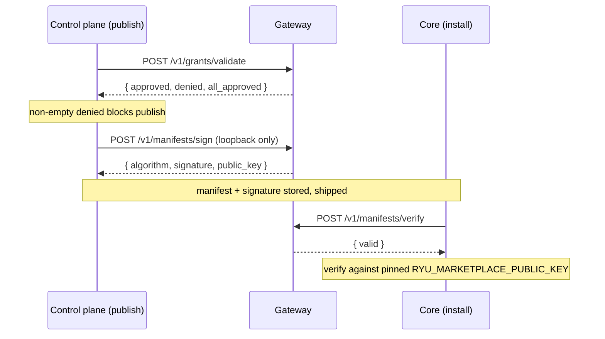

Publishing an app to the Ryu Marketplace, and installing one, are governed actions. Per the
[Core vs Gateway](/docs/start-here/architecture/core-vs-gateway) rule, "what is allowed, shared,
measured, or paid for" lives in the Gateway, so the two governance primitives that gate the
marketplace ceremony are served here: **grant validation** and **ed25519 manifest signing**. The
control-plane server calls them on publish; Core calls them on install. The same allowlist also
authorizes the Identity Vault credential scopes (`identity.read`, `browser.connect`).

This page is the reference for those four endpoints. The credential-vault mechanics live in
[Identity Vault](/docs/core/identity-vault); the publishing flow lives in
[Marketplace](/docs/develop/extensions/marketplace).

Source: `apps/gateway/src/api/governance.rs` (HTTP surface) and
`apps/gateway/src/governance/mod.rs` (logic).

## The ceremony

## Endpoints

| Method | Route | Caller | Returns |
|---|---|---|---|
| `POST` | `/v1/grants/validate` | Server (publish), Core (install) | `{ approved, denied, all_approved }` |
| `POST` | `/v1/manifests/sign` | Server (publish), loopback only | `{ algorithm, signature, public_key }` |
| `POST` | `/v1/manifests/verify` | Core (install) | `{ valid }` |
| `GET` | `/v1/manifests/pubkey` | any | `{ algorithm, public_key }` |

These are read-only computations over caller-supplied data. They mutate no Gateway state and expose
no secret (only the public verifying key), so they sit outside the master-key admin gate that
`/v1/config` and `/v1/audit` use. Routes are registered in `apps/gateway/src/api/mod.rs`.

## Grant validation

A manifest declares the permission grant scopes it wants in its `ryu.json` `permission_grants`.
`POST /v1/grants/validate` checks each declared scope against the Gateway's allowlist and partitions
them into `approved` and `denied`. A non-empty `denied` set blocks publish - this is the fail-closed
contract: an over-privileged manifest cannot ship.

Request fields (`ValidateGrantsRequest`):

| Field | Type | Notes |
|---|---|---|
| `app_id` | `string?` | For logging/audit context only |
| `grants` | `string[]` | The declared scopes to check |

Matching is case-insensitive on the trimmed scope string, and an empty `grants` list approves
trivially. The default allowlist (`default_grant_allowlist` in `apps/gateway/src/governance/mod.rs`)
covers the first-party capability scopes:

| Group | Scopes |
|---|---|
| Tool / MCP | `mcp.tools`, `tools.read`, `tools.invoke` |
| Data | `memory.read`, `memory.write`, `spaces.read`, `spaces.write`, `files.read` |
| Model / network | `model.chat`, `model.embed`, `network.fetch` |
| Identity Vault | `browser.connect`, `identity.read` |

Override the allowlist with the `RYU_MARKETPLACE_GRANT_ALLOWLIST` env var (comma or whitespace
separated). Anything outside the active allowlist is denied.

<Callout type="info">
On the Core side, plugin lifecycle (`apps/core/src/plugins/lifecycle.rs`) calls this endpoint.
Until the Gateway implemented it, Core had only a `RYU_STUB_GRANT_VALIDATION` allow-all stub. The
Gateway now owns the real decision.
</Callout>

## Manifest signing and verification

The Gateway owns an ed25519 signing key. On publish the server asks the Gateway to sign the
manifest; on install Core asks the Gateway to verify the signature. A manifest tampered with
anywhere along TypeScript server to Mongo to Core fails verification and is rejected.

Both sign and verify **canonicalize** the manifest first - object keys are recursively sorted and
insignificant whitespace is dropped (`canonical_bytes` / `canonicalize`). This makes the signed
bytes independent of key ordering introduced by Mongo storage or JSON re-serialization, so a
faithfully preserved manifest verifies even after a round-trip.

`POST /v1/manifests/sign` request is `{ manifest }`; the response is:

| Field | Value |
|---|---|
| `algorithm` | `"ed25519"` (`SIGNING_ALGORITHM`) |
| `signature` | base64 ed25519 signature over the canonicalized manifest |
| `public_key` | base64 verifying key |

`POST /v1/manifests/verify` request is `{ manifest, signature, public_key? }`; the response is
`{ valid }`. When `public_key` is omitted the Gateway uses its own key (the same-process common
case). When supplied, it verifies against that key.

### Key material

| Env var | Role | Fallback |
|---|---|---|
| `RYU_MARKETPLACE_SIGNING_KEY` | base64 32-byte ed25519 seed (the private signing key) | ephemeral key generated at startup |
| `RYU_MARKETPLACE_PUBLIC_KEY` | the pinned verifying key Core verifies against on install | the manifest's self-attested key is never trusted |

<Callout type="warn">
Sign is **loopback-only** and is neutralized under mesh. The Gateway can bind `0.0.0.0`, so a
network-reachable signing oracle would let anyone get any manifest signed under the trusted key,
defeating the point. `sign_manifest` rejects non-loopback peers and also rejects when
`mesh_enabled()` is true - under userspace networking a tailnet peer appears as `127.0.0.1`, so a
bare loopback check would expose the oracle to the whole tailnet. Verify, validate, and pubkey have
no such restriction.
</Callout>

<Callout type="warn">
If `RYU_MARKETPLACE_SIGNING_KEY` is unset the Gateway generates an **ephemeral** key at startup.
Sign and verify round-trip within one process, but signatures do not survive a restart. Set the env
var in production so published signatures stay valid.
</Callout>

Install-time verify uses a **pinned** `RYU_MARKETPLACE_PUBLIC_KEY`, never the public key the
manifest carries about itself. See [Marketplace](/docs/develop/extensions/marketplace) for where
this sits in the publish and install flow.

## The identity.read grant

The `identity.read` and `browser.connect` scopes on the allowlist authorize the
[Identity Vault](/docs/core/identity-vault). When an agent with a bound, authenticated connection
calls a tool that targets a matching domain, Core's consult seam
(`apps/core/src/identity/consult.rs`) reads the sealed credential through the gateway-governed
`read_credential` gate. That read exercises the `identity.read` grant and emits an audit record on
every authenticated tool hit.

The credential is consumed only at that boundary - it is never returned to the caller and never
placed in the tool result the model sees (the three-layer invariant). A `NEEDS_AUTH` connection
returns a login elicitation envelope instead, and the tool is not dispatched.

<Callout type="warn">
Fail-closed read proceeds without the credential. If the grant read is denied (for example an
unreachable dev gateway), the tool call proceeds *without* the credential rather than hard-failing,
and the tool surfaces its own auth error. The `NEEDS_AUTH` elicitation path is unaffected. The full
behavior, including which tools actually consume a credential, lives in
[Identity Vault](/docs/core/identity-vault).
</Callout>

## Related

<Cards>
  <DocCard href="/docs/core/identity-vault" />
  <DocCard href="/docs/develop/extensions/marketplace" />
  <DocCard href="/docs/gateway/security" />
  <DocCard href="/docs/gateway/evals-audit" />
</Cards>
