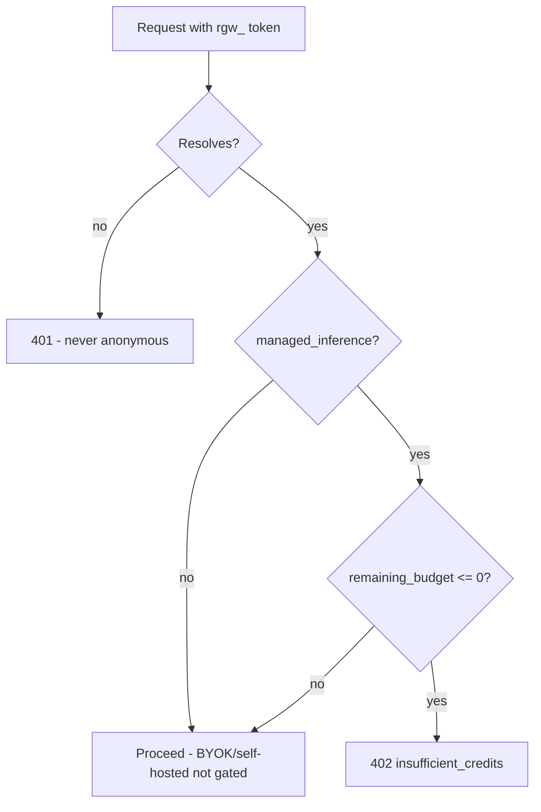

The same Gateway binary that Core runs locally can be deployed once and shared by many organizations as the hosted managed-cloud **data plane**. In that topology, clients point at one Gateway and each carries its own minted `rgw_` token. The Gateway resolves that token to an org, its credit budget, and its effective policy on every request, then enforces a pre-flight credit gate before dispatch. This page explains how that multi-tenant path works.

<Callout type="warn">
This is a **hosted-only** path and runs as a **single replica**. Every counter (budgets, rate limits, the resolve cache) is an in-process map, so N replicas each grant a full quota. Shared cross-replica state is not built. Deploy one instance per fleet. When there is no `CONTROL_PLANE_URL`, the dynamic path is a no-op and the Gateway behaves as the ordinary single-org process documented in [Configuration and auth](/docs/gateway/configuration).
</Callout>

## Per-request org identity

A standalone Gateway authenticates one org at startup with its own `rgw_` key. The multi-tenant path instead resolves the org **per request** from whatever `rgw_` bearer the client sent. Any valid, non-revoked token resolves to its own org.

```
Authorization: Bearer rgw_<org-token>
```

Resolution goes through `resolve_token` (`apps/gateway/src/policy/mod.rs`), which calls the control plane:

```
GET {CONTROL_PLANE_URL}/api/control-plane/gateway/resolve
x-gateway-key: rgw_<org-token>
```

The response maps to a `ResolvedOrg` carrying the fields the pipeline needs to attribute and gate the request.

| Field | Meaning |
|---|---|
| `org_id` | The organization the token belongs to |
| `managed_inference` | Whether the org bills through the credit wallet. Only managed tenants get the pre-flight credit gate; BYOK / self-hosted do not |
| `remaining_budget_micro_usd` | Authoritative remaining credit in micro-USD, or `None` when uncapped. `Some(b)` with `b <= 0` means the wallet is exhausted |
| `policy` | The org's effective policy - `approved_models` allowlist, `locked_guardrails`, `allowed_regions`, and the cascaded firewall overlays |

The control plane has already cascaded org/team/project/user layers and honoured admin locks, so the data plane receives one resolved policy and enforces it - it never re-derives the cascade.

### Hard-401 on an unresolved token

An `rgw_`-shaped bearer that does not resolve (invalid, revoked, or the control plane is unreachable) maps to a hard `401`. It is never let through as anonymous, and the resolved context sets `is_master_key = false`, so admin routes still reject it.

## The resolve cache

Resolving a token is a control-plane round-trip, so `ResolveCache` (`apps/gateway/src/policy/cache.rs`, a `DashMap` keyed by token) caches the outcome with a DNS-style split TTL. The raw token is only ever a map key - it is never logged.

| Outcome | TTL | Why |
|---|---|---|
| Positive (resolved org) | 60s | Keeps the hot path off the control plane, and bounds budget staleness: a topped-up org auto-recovers within one window |
| Negative (invalid / revoked / unreachable) | 10s | Blunts a resolve-DoS from a flood of bad bearers, but short enough that a just-minted token is not locked out for long |

The cache is enabled only when `CONTROL_PLANE_URL` is configured (`ResolveCache::from_env`).

## The pre-flight credit gate

Credit enforcement is **pre-flight**, in `preflight_credit_gate` (`apps/gateway/src/pipeline/mod.rs`, run inside `enforce_budget`). It fires before dispatch, so an empty wallet blocks the request rather than one that already ran.



The gate reads the freshly-resolved balance (bounded by the 60s cache), so it **auto-recovers** after a top-up. It deliberately does not use a sticky wallet-empty flag, which would strand a topped-up org.

`insufficient_credits` is a distinct error from `budget_exceeded`. Both return HTTP `402`, but they mean different things.

| Error code | HTTP | Meaning |
|---|---|---|
| `insufficient_credits` | 402 | A managed org's credit wallet is exhausted (the pre-flight gate) |
| `budget_exceeded` | 402 | A per-user / per-agent / per-session token budget period cap was hit ([Reliability](/docs/gateway/reliability)) |

The post-call credit debit (which subtracts the served call's cost from the org wallet) is documented under `[credits]` in [Configuration and auth](/docs/gateway/configuration).

## Per-tool-call debits

The token debit above bills the model call. On the managed plan a request can also run **Composio**
tool actions, and Composio charges per action execution, so those are billed separately. Each tool
loop returns `(value, billable_count)`; `run_tool_loop` (`apps/gateway/src/tools/mod.rs`) counts the
executed `composio__*` calls (prefix `COMPOSIO_TOOL_PREFIX`) that pass the allowlist gate. Denied,
builtin, MCP, and app tool calls are free and never counted.

At request end, `spawn_tool_call_debit` (`apps/gateway/src/pipeline/mod.rs`) fires one debit for the
whole request - `count × cost_per_tool_call_micro_usd`, at cost - against the org wallet.

| Field | Value | Why it matters |
|---|---|---|
| `reason` | `composio` | Distinguishes the tool-call ledger row from the `gateway_usage` token row |
| `refId` | `{request_id}:composio` | A **distinct** ref from the token debit's `{request_id}`. `applyDelta` is idempotent on `refId`, so reusing the request id would dedupe the tool debit against the token debit and silently drop it |
| Cost source | `[credits] cost_per_tool_call_micro_usd` | Per-executed-call rate; `0` (the default) means tool calls are free until a deployment provisions a rate |

The debit is spawned off the response path so it never adds client latency, and it is a no-op when
credits are inactive, the org is absent, the billable count is zero, or the per-call cost is unset.
Managed nodes provision the rate through the `GATEWAY_CREDITS_COST_PER_TOOL_CALL_MICRO_USD` env var
(`from_env` in `apps/gateway/src/config.rs`).

<Callout type="info">
  The service-to-service tool path (`POST /v1/exec/tool`, trusted-forwarder / master-key only) has no
  per-user org context, so it is not metered here - it is bounded by the exec budget instead, covered
  on the [tools](/docs/gateway/tools) page.
</Callout>

<Callout type="warn">
Do not set `GATEWAY_CREDITS_FAIL_CLOSED=1` together with the default `wallet_empty_action = stop`. A transient control-plane blip flips the sticky wallet-empty flag, the next request is stopped before dispatch, and the debit that would clear the flag never runs - stranding the org until a process restart. Pair fail-closed with a self-healing action (`downgrade` / `restrict`), or leave it off.
</Callout>

## Deploying the fleet Gateway

`apps/gateway/Dockerfile` builds and runs **only** the Gateway (AGPL-3.0, port 7981), so a fleet deploy never compiles Core. The build context is the repo root, but it copies only the self-contained `apps/gateway` crate (its own `Cargo.lock`, zero path dependencies); the rest of the monorepo is never transferred.

Boot requirements baked into the image and enforced by the binary:

- On a non-loopback bind, the Gateway **hard-refuses to start** without `GATEWAY_MASTER_KEY` (which also flips `require_auth` on).
- Behind a load balancer, also set `RYU_GATEWAY_FLEET=1` so co-located proxy peers that appear as `127.0.0.1` cannot reach the admin surface (`/v1/config`, `/v1/audit`) without the master key.
- The entrypoint binds `0.0.0.0:7981`; `/health` is an unauthenticated liveness endpoint. Mount a volume at `/data` and set `GATEWAY_CONFIG=/data/gateway.toml` if you want static per-tenant `api_keys` and the audit store to survive redeploys.

## Related

<Cards>
  <DocCard href="/docs/gateway/configuration" />
  <DocCard href="/docs/gateway/reliability" />
  <DocCard href="/docs/gateway/security" />
  <DocCard href="/docs/gateway/governance" />
</Cards>
