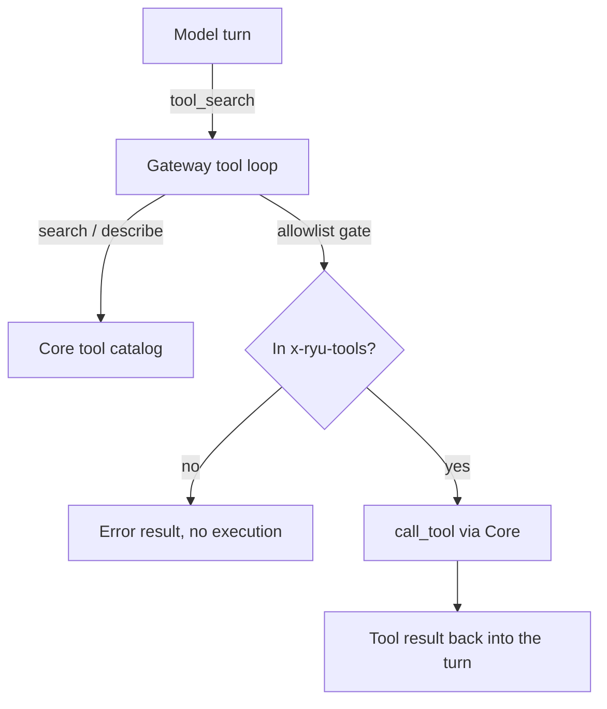

The gateway is the governance front for tool use. It decides *what is allowed, measured, and audited*; Core decides *what runs* (search ranking and the actual tool execution). This page is the reference for the gateway-side surfaces that close the loop: the `tool_search` meta-tool injected into chat requests, the buffered tool-call loop, and `POST /v1/exec/tool` for direct programmatic execution.

This surface shipped as part of epic #473 (the unified tool gateway). The Core-side catalog it queries, and the programmatic-tool-calling sandbox it forwards to, are documented elsewhere:

<Cards>
  <DocCard href="/docs/core/unified-tool-catalog" />
  <DocCard href="/docs/core/programmatic-tool-calling" />
</Cards>

## Two planes, one governance front

Both chat planes route tool execution through the gateway, so the allowlist and audit apply uniformly:

- **OpenAI-compat plane** - the gateway injects `tool_search` and drives a buffered search-describe-call loop (`apps/gateway/src/tools/mod.rs`).
- **ACP plane** - Core's MCP bridge offers the same `tool_search`/`describe`/`execute`/`resume` meta-tools to ACP sessions (`apps/core/src/sidecar/adapters/mcp_bridge.rs`), and routes execution through the same governed path.

Every privileged operation crosses from the gateway to Core over HTTP via the `providers.core` client, which is configured by `CORE_URL` and `CORE_TOKEN` (set by Core when it spawns the gateway as a managed sidecar).



## The `tool_search` meta-tool

Instead of handing the model every tool, the gateway injects a single discovery tool. The model calls `tool_search` first to find a capability, then calls the returned tool by its exact fully-qualified id.

- The name is `tool_search` (`TOOL_SEARCH_NAME`, `apps/gateway/src/tools/mod.rs`).
- It is **always permitted** and never allowlist-gated. Search is not a grant: discovering a tool does not authorize executing it.
- Its definition is byte-identical to the one the ACP bridge offers, so both planes expose the same contract.

The parameters the model sees:

| Field | Type | Default | Meaning |
|---|---|---|---|
| `query` | string | required | Natural-language description of the capability needed |
| `kind` | enum `mcp` `builtin` `composio` `app` `any` | `any` | Filter by tool source plane |
| `limit` | integer (1-25) | `8` | Max results |

When the model calls `tool_search`, the gateway queries Core's catalog, describes the top hits, and injects their full tool definitions into the request so the model can call them by exact id on the next round. The result the model receives is a compact descriptor list (`id`, `name`, `description`).

## The buffered tool-call loop

On the OpenAI-compat plane the tool loop (`run_tool_loop`) runs against a non-streaming provider, then synthesizes the final SSE stream from the buffered turn (`value_to_sse_stream`). Each round:

1. The provider produces an assistant turn. If it has no `tool_calls`, the loop returns it (terminal).
2. The assistant turn is appended, then each tool call is handled:
   - `tool_search` queries Core and injects described defs.
   - Any other id passes the allowlist gate. A denial returns an error *result* (the model sees it as a tool message), never an execution.
   - Allowed ids execute via Core `call_tool`.
3. The loop repeats until there are no tool calls or `max_rounds` is reached.

If the loop exhausts `max_rounds` while the model is still emitting tool calls, the final turn is marked with `finish_reason: "length"` so the client can tell the turn was truncated rather than a clean stop.

### When the loop runs

The unified loop is gated so plain chat keeps its fast streaming path with no added latency. Two header signals are involved (parsed in `apps/gateway/src/pipeline/mod.rs`):

| Header | Field | Role |
|---|---|---|
| `x-ryu-tools` | `tool_actions` / `tools_header_present` | CSV of fully-qualified tool ids = the egress allowlist. Its literal presence is the trigger for the unified loop |
| `x-ryu-tool-search: on` | `tool_search_requested` | Explicit opt-in to the buffered search loop |

A bare Composio agent that carries only the legacy `x-ryu-composio-actions` header keeps its fast streaming path and the legacy Composio loop, never the unified loop. Core's ACP forwarder never sets `x-ryu-tool-search`, so there is no double surface on ACP egress.

## The allowlist: fully-qualified ids only

The allowlist key is the fully-qualified tool id (`<server>__<tool>`, for example `spider__crawl`) end to end. A request's allowlist comes from `x-ryu-tools`; an empty allowlist denies all non-`tool_search` execution (search still works, execution is gated).

Matching is exact on the FQ id. Bare-name and bare-server entries are deliberately rejected: an entry like `search` must not authorize `exa__search` or `composio__search` across planes. To grant a whole server, use the explicit `<server>__*` id form upstream, never a bare-server equality.

```
x-ryu-tools: spider__crawl,exa__search
```

## `POST /v1/exec/tool` - the direct exec front

For programmatic execution outside the chat loop (the PTC path and direct tool calls), the gateway exposes one governed endpoint (`apps/gateway/src/tools/exec.rs`).

```
POST /v1/exec/tool
```

It discriminates on `kind`:

| `kind` | Forwards to Core | Purpose |
|---|---|---|
| `tool` (default) | `POST /api/mcp/tools/call` | Run a single tool by `tool_id` |
| `execute` | `POST /api/tools/exec` | Run model-authored code (PTC) |
| `resume` | `POST /api/tools/exec/resume` | Resume a paused PTC run (HITL) |

Key request fields:

| Field | Used by | Notes |
|---|---|---|
| `kind` | all | Defaults to `tool` |
| `tool_id` | `tool` | Required when `kind=tool` |
| `arguments` | `tool` | Tool arguments object |
| `code` | `execute` | The PTC code to run |
| `execution_id` | `resume` | The paused run to resume |
| `agent_id` | all | Logically required; Core is fail-closed and agent-scoped |
| `user_id`, `session_id` | all | Identity and budget attribution |

The response is `{ ok, result?, error? }`, with `result` and `error` omitted when absent.

### Governance gate

The exec front is locked down. The caller must be a trusted forwarder or the master key, and the trust is neutralized when the mesh is on:

```
(trusted_forwarder || master_key) && !mesh_enabled()
```

A non-trusted, non-master caller is rejected with `401 Unauthorized`. The mesh neutralization exists because userspace networking makes mesh peers appear as `127.0.0.1`, so loopback-trust gates would otherwise fail open (`RYU_MESH_ENABLED`, `apps/gateway/src/tools/mod.rs`).

## Budget and audit

Tool and code execution carry their own governance, separate from chat-token budgets:

- **Exec budget** - the `ExecBudgetEnforcer` enforces count and wall-clock limits per rolling window, checked pre-run via `POST /v1/exec/budget/check` (`apps/gateway/src/state.rs`).
- **Exec audit** - every governed execution emits an audit event, so tool/PTC egress is recorded the same way model calls are.

Together with the allowlist gate, this is what makes the prior ACP/registry *tool* egress bypass closed: tool execution on both planes is allowlist-gated and emits exec-budget plus exec-audit.

<Callout type="warn">
  This page governs *tool* egress. An ACP agent's own in-subprocess LLM provider calls (for agents that expose no base-URL hook) still bypass the gateway. That chat-egress gap is tracked separately and is not closed by this surface. The `execute`/`resume` exec kinds forward to Core's PTC endpoints; see [Programmatic tool calling](/docs/core/programmatic-tool-calling) for that side.
</Callout>

## Related

<Cards>
  <DocCard href="/docs/core/unified-tool-catalog" />
  <DocCard href="/docs/core/programmatic-tool-calling" />
  <DocCard href="/docs/gateway/governance" />
  <DocCard href="/docs/gateway/configuration" />
</Cards>
