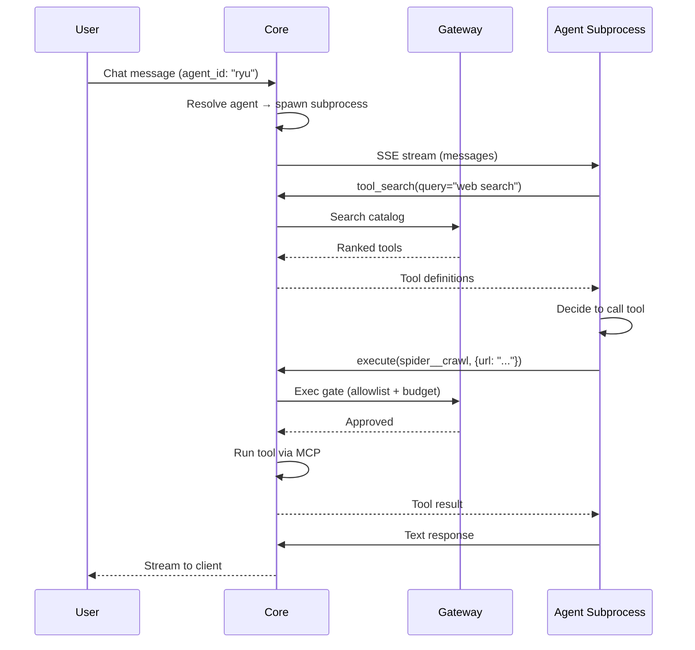
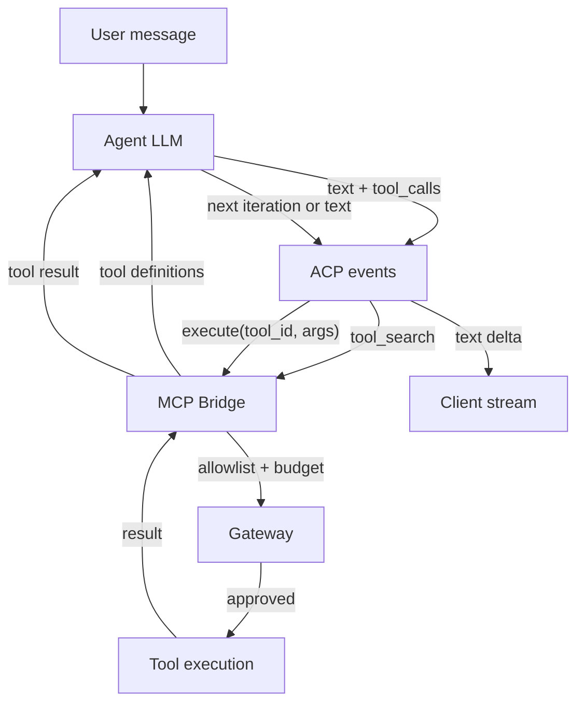
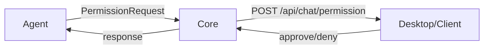
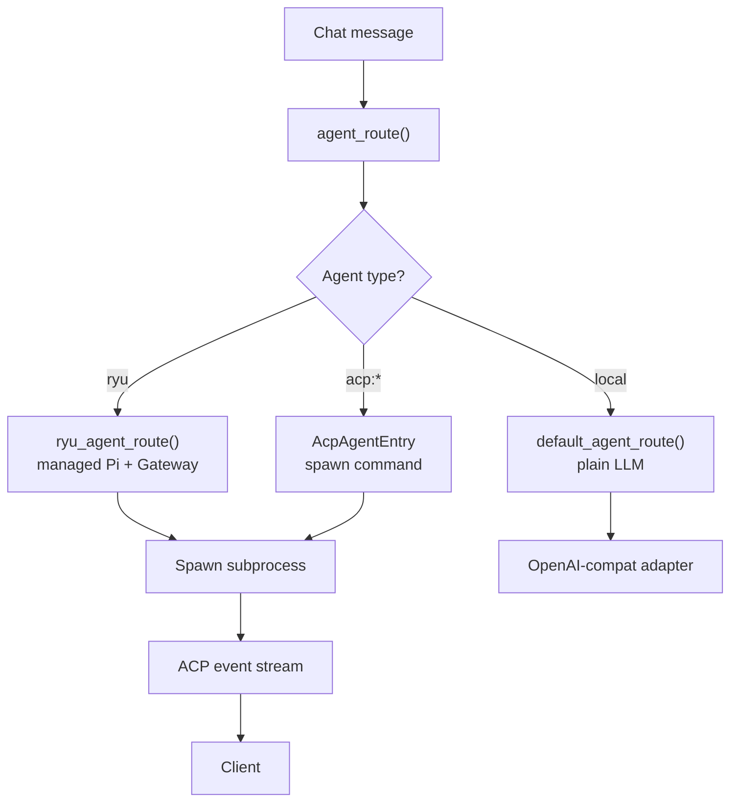

The Agent Client Protocol (ACP) is how Ryu drives agent subprocesses. Each agent runs as its own
process, streams events back to Core in the Vercel AI SDK format, and gets a full tool loop for
reading files, running commands, and editing code.

## How it works

1. Core resolves the agent from the `agent_id` in the chat request.
2. Core spawns the agent's subprocess with its configured command.
3. The agent streams SSE events back to Core (text deltas, tool calls, tool results).
4. Core's MCP bridge offers `tool_search`/`describe`/`execute`/`resume` meta-tools to the agent.
5. The Gateway governs every model call the agent makes (if routed through it).



## The MCP bridge meta-tools

The MCP bridge (`apps/core/src/sidecar/mcp_bridge.rs`) offers four always-on meta-tools to every
ACP agent:

| Meta-tool | What it does |
|---|---|
| `tool_search` | Discover tools by query — BM25 + semantic ranking over the full catalog |
| `describe` | Get detailed info about a specific tool (schema, annotations, examples) |
| `execute` | Call a tool by id with arguments — goes through allowlist + budget + audit |
| `resume` | Resume a parked execution (for long-running tools) |

These meta-tools are the agent's interface to Core's entire tool ecosystem. The agent never calls
tools directly — it always goes through the bridge.

## The tool loop

ACP agents run a full tool loop:



The loop continues until the agent produces a text response with no tool calls, or the maximum
iterations are reached.

## Gateway egress routing

ACP agents make their own LLM calls inside their subprocess. Whether those calls traverse the
Gateway depends on the agent:

| Mechanism | Agents | How it works |
|---|---|---|
| **Base-URL injection** | `ryu`, `pi`, BYO OpenAI-compatible | Core injects `OPENAI_BASE_URL` pointing at the Gateway `/v1`. The agent's HTTP client routes through the Gateway. |
| **Passthrough proxy** | Claude Code, Codex | The Gateway runs a transparent reverse proxy in the agent's native wire format (Anthropic Messages / OpenAI Responses). Subscription credentials are forwarded unchanged. |
| **No interception** | Gemini CLI, OpenClaw, Hermes | These agents ignore `OPENAI_BASE_URL` or use their own credential system. Chat egress bypasses the Gateway. Tool egress is still governed via MCP. |

## The BYO agent path

For an agent you add yourself (not in the curated registry), Core offers a generic per-agent
gateway-routing toggle. When enabled:

1. Core injects `OPENAI_BASE_URL=http://localhost:7981/v1` into the agent's spawn environment.
2. Core injects `OPENAI_API_KEY=<gateway-token>`.
3. The agent's HTTP client routes model calls through the Gateway.

This works for any agent that reads `OPENAI_BASE_URL`. It is a no-op for agents that do not.

### Setup

Add your agent to the catalog:

```bash
# Add a custom ACP agent
curl -X POST http://localhost:7980/api/agents/catalog/install \
  -H 'Content-Type: application/json' \
  -d '{
    "id": "my-agent",
    "name": "My Agent",
    "engine": "acp-exec:npx -y my-agent-cli",
    "transport": "acp"
  }'
```

Enable gateway routing for the agent:

```bash
# Enable gateway routing via preferences
curl -X PUT http://localhost:7980/api/preferences \
  -H 'Content-Type: application/json' \
  -d '{
    "key": "agent-gateway-routing",
    "value": { "my-agent": true }
  }'
```

## ACP events

The agent streams events back to Core in the Vercel AI SDK format:

| Event | What it carries |
|---|---|
| `Text` | Text delta (assistant response chunk) |
| `UserText` | User message echo |
| `Thought` | Reasoning/thinking content |
| `Plan` | Agent's plan |
| `ToolCall` | Tool invocation with name + args |
| `ToolResult` | Tool execution result |
| `Media` | Image or file attachment |
| `ModeChanged` | Agent mode change |
| `ConfigWarning` | Configuration warning |
| `AvailableCommands` | Commands the agent supports |
| `PermissionRequest` | Requesting user permission |
| `Usage` | Token usage stats |
| `ToolWidget` | Widget rendering data |
| `Error` | Error event |

## Permission system

ACP agents can request permissions from the user through a back-channel:



| Permission type | What it gates |
|---|---|
| File system access | Read/write files outside the workspace |
| Command execution | Run shell commands |
| Network access | Make outbound HTTP requests |

## Config probe

When Core spawns an ACP agent, it probes the agent's capabilities:

| Probe | What it discovers |
|---|---|
| Modes | Available agent modes (code, chat, etc.) |
| Models | Supported models |
| Config options | Agent-specific configuration |
| Auth methods | How the agent authenticates |
| Agent capabilities | What the agent can do |

This information is surfaced in the desktop UI so users can configure the agent.

## Agent routing

The full routing chain for ACP agents:



## Agent catalog endpoints

| Method | Path | Purpose |
|---|---|---|
| `GET` | `/api/agents` | List installed agents |
| `GET` | `/api/agents/catalog` | Browse installable agents |
| `POST` | `/api/agents/catalog/install` | Add a catalog agent |
| `POST` | `/api/agents/catalog/uninstall` | Remove a catalog agent |

## Related

<Cards>
  <DocCard href="/docs/start-here/architecture/acp-agents" />
  <DocCard href="/docs/start-here/architecture/ryu-agent" />
  <DocCard href="/docs/gateway/gateway-for-any-agent" />
  <DocCard href="/docs/core/unified-tool-catalog" />
  <DocCard href="/docs/gateway/tools" />
</Cards>
