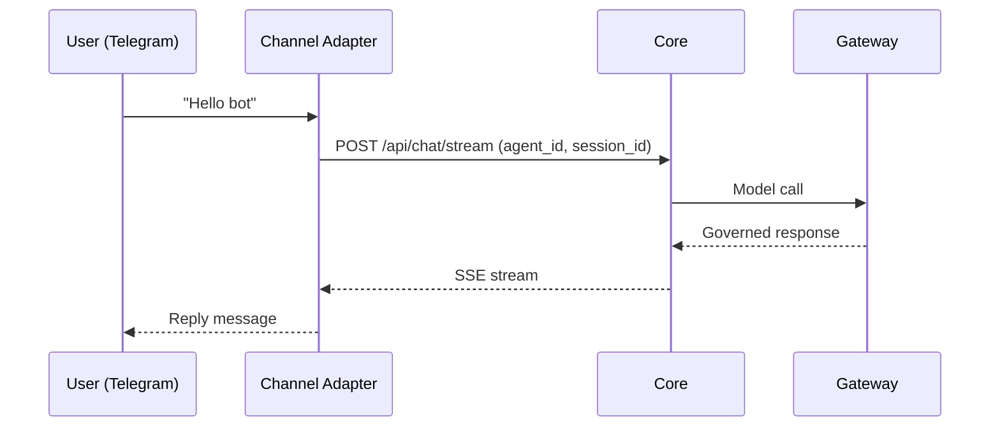

Ryu can run bots on messaging platforms through channel adapters. Each channel has its own adapter
that translates platform events into Core chat sessions and streams responses back.

## Supported channels

| Channel | Adapter | Auth |
|---|---|---|
| Telegram | `apps/core/src/sidecar/adapters/telegram.rs` | `TELEGRAM_BOT_TOKEN` |
| Slack | `apps/core/src/sidecar/adapters/slack.rs` | `SLACK_APP_TOKEN` + `SLACK_BOT_TOKEN` |
| WhatsApp | `apps/core/src/sidecar/adapters/whatsapp.rs` | `WHATSAPP_ACCESS_TOKEN` |
| Discord | `apps/core/src/sidecar/adapters/discord.rs` | `DISCORD_BOT_TOKEN` |

## How it works



The channel adapter:
1. Receives the platform event (message, command, callback).
2. Maps it to a Core chat request with an `agent_id` and `session_id`.
3. Streams the response back to the platform.

## Gateway config for channels

Channel bot tokens are configured in `gateway.toml`:

```toml
[channels.telegram]
bot_token = "TELEGRAM_BOT_TOKEN"

[channels.slack]
app_token = "SLACK_APP_TOKEN"
bot_token = "SLACK_BOT_TOKEN"

[channels.discord]
bot_token = "DISCORD_BOT_TOKEN"
```

See [Gateway Channels](/docs/gateway/channels) for the full configuration.

## Multi-tenant routing

Channel bots can route messages to different Core nodes or agents based on the platform user.
The Gateway's `x-ryu-user-id` header carries the platform user identity, which drives per-user
budgets and audit.

## Related

<Cards>
  <DocCard href="/docs/gateway/channels" />
  <DocCard href="/docs/gateway/configuration" />
  <DocCard href="/docs/core/node-and-presence" />
  <DocCard href="/docs/develop/extensions/channel-bot" />
</Cards>
