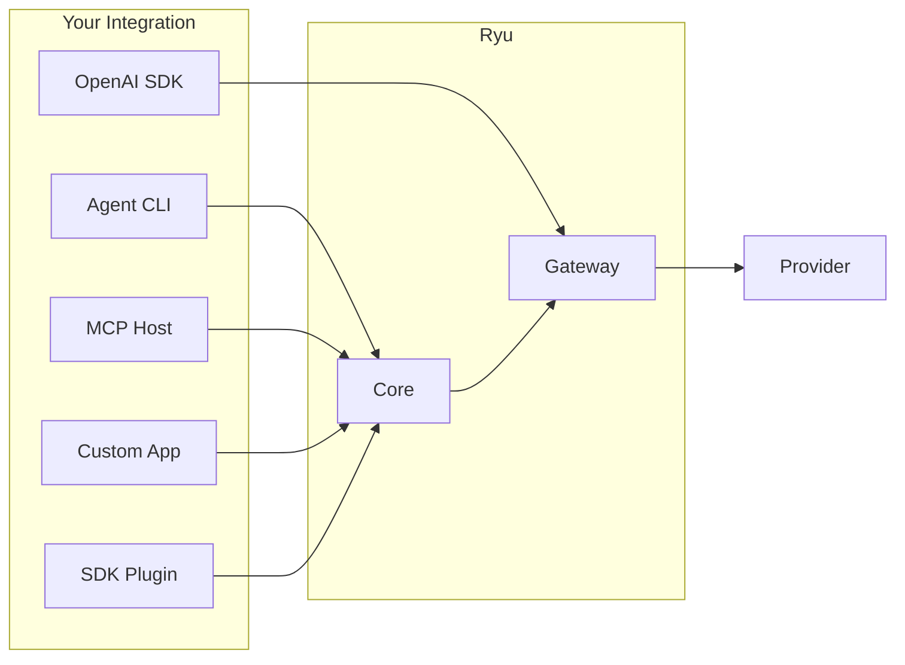

Ryu exposes **five integration surfaces**. Each serves a different caller; none requires modifying Ryu
itself. Every model call flows through the Gateway, regardless of surface.

## Integration surfaces

| Surface | Protocol | Who calls it | Gateway-governed? | Start here |
|---|---|---|---|---|
| **OpenAI-compat API** | OpenAI `/v1/chat/completions` | Any framework, SDK, or raw HTTP client that speaks OpenAI format | Yes (full pipeline) | [OpenAI-compat](/docs/integrate/openai-compat) |
| **ACP agent protocol** | Subprocess + SSE events | Agent CLIs (Claude Code, Codex, Gemini, Pi, BYO) | Opt-in per agent | [ACP Integration](/docs/integrate/acp-integration) |
| **MCP server** | MCP over stdio (JSON-RPC) | MCP hosts (Claude Desktop, IDEs, other agents) | Yes (tool exec) | [MCP Integration](/docs/integrate/mcp-integration) |
| **Core HTTP API** | REST + SSE | Custom apps, scripts, the `@ryuhq/client` SDK | Yes (via Gateway) | [API Reference](/docs/develop/api-reference) |
| **TypeScript SDK** | `@ryuhq/sdk` (typed) | Plugin authors, extension builders | Yes (Gateway-mandatory) | [SDK Reference](/docs/develop/sdk) |

## The decision matrix

```
Do you need a model call?
├─ Yes → Which protocol does your caller speak?
│   ├─ OpenAI-compatible → OpenAI-compat API
│   ├─ Anthropic Messages → Gateway passthrough proxy
│   ├─ ACP subprocess → ACP agent
│   └─ MCP → MCP server
├─ Yes, but you want typed TypeScript → TypeScript SDK
├─ No, just tools/data → Core HTTP API or MCP
└─ No, you want to build a plugin → manifest.json manifest
```

## Architecture in one sentence

> **Core decides what runs; the Gateway decides what is allowed, measured, and paid for.**

Every integration surface routes model calls through the Gateway. The Gateway applies firewall
(PII/DLP), budget enforcement, rate limiting, circuit breaking, caching, evals, and audit before
the request reaches any provider.



## Quick start by role

### I'm building an AI agent
Start with [OpenAI-compat](/docs/integrate/openai-compat) — point your agent at `http://localhost:7981/v1` and every model call is governed.

### I'm adding tools to an agent
Start with [MCP Integration](/docs/integrate/mcp-integration) — expose tools over MCP and register them with Core.

### I'm extending Ryu itself
Start with [Build an Extension](/docs/develop/extensions) — plugins, SDK, manifests, and hooks.

### I'm hosting Ryu for a team
Start with [Gateway Configuration](/docs/gateway/configuration) — auth, budgets, firewall, and routing.

## Related

<Cards>
  <DocCard href="/docs/integrate/openai-compat" />
  <DocCard href="/docs/integrate/acp-integration" />
  <DocCard href="/docs/integrate/mcp-integration" />
  <DocCard href="/docs/develop/extensions" />
  <DocCard href="/docs/gateway/configuration" />
  <DocCard href="/docs/start-here/architecture/core-vs-gateway" />
</Cards>
