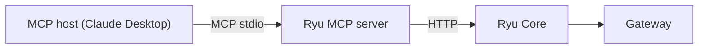
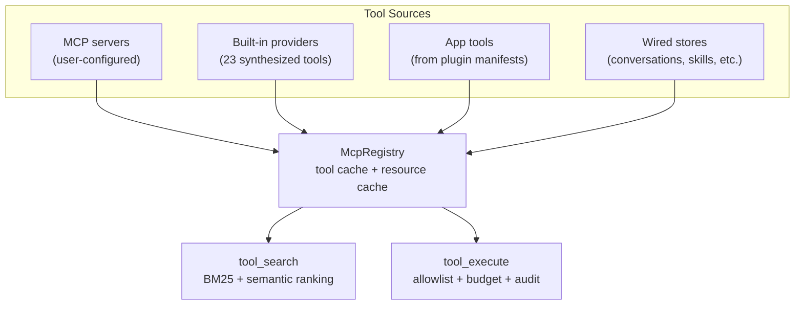
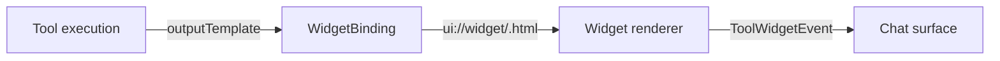

Ryu has two MCP integration points:

1. **Ryu as MCP server** — expose your Ryu node's tools to any MCP host (Claude Desktop, IDEs,
   other agents).
2. **Ryu as MCP client** — consume external MCP servers as tools inside your agents.

Both routes route tool execution through the Gateway for allowlist gating, budget enforcement,
and audit.

## Ryu as MCP server

The MCP server (`apps/mcp`) bridges MCP hosts to a Ryu Core node over HTTP. It holds no model and
runs no inference — it translates MCP tool calls into Core HTTP requests.



### Setup

```bash
# The MCP server reads RYU_CORE_URL and RYU_CORE_TOKEN
RYU_CORE_URL=http://localhost:7980 RYU_CORE_TOKEN=... node apps/mcp/dist/index.js
```

Point your MCP host at this server's stdio command. The MCP server's tools are exactly Core's
tool catalog — every tool search, describe, and execute call goes through the governed path.

See [MCP Server](/docs/mcp) for the full setup and configuration.

## Ryu as MCP client

Core consumes external MCP servers as tool sources. Register an MCP server and its tools become
searchable and callable from chat.

### Register an MCP server

```bash
curl -X POST http://localhost:7980/api/mcp/servers \
  -H 'Content-Type: application/json' \
  -d '{
    "name": "my-tools",
    "command": ["npx", "-y", "my-mcp-server"],
    "env": { "API_KEY": "..." }
  }'
```

### How tools are exposed

Once registered, the MCP server's tools appear in the unified tool catalog. On the ACP plane, the
MCP bridge offers `tool_search` → `execute` to agents. On the OpenAI-compat plane, the Gateway
injects `tool_search` into the request body.

Tool execution always goes through:
1. **Core** — tool search ranking and catalog management
2. **Gateway** — allowlist gate, exec budget, exec audit

See [Unified Tool Catalog](/docs/core/unified-tool-catalog) and
[Gateway Tools](/docs/gateway/tools) for the governance details.

## MCP bridge internals

The MCP bridge (`apps/core/src/sidecar/mcp/`) is the central hub for tool management. It handles
tool discovery, dispatch, and the widget system.

### The McpRegistry

The `McpRegistry` is the single source of truth for all tools in Ryu:



### Built-in MCP providers

Core synthesizes 23 built-in tools without spawning external processes:

| Provider | Tools | Purpose |
|---|---|---|
| `shadow` | screen capture, OCR | Screen perception |
| `spider` | web crawl, scrape | Web scraping |
| `exa` | web search | Web search |
| `rtk` | retrieval toolkit | RAG operations |
| `web_fetch` | fetch URL | HTTP fetching |
| `sandbox` | code exec | Wasmtime sandbox |
| `notify` | send notification | Notification fan-out |
| `channel` | channel operations | Bot channel access |
| `search_conversations` | search chats | Conversation search |
| `threads` | thread operations | Thread management |
| `delegate` | delegate to agent | Agent delegation |
| `orchestrator` | orchestrate | Multi-agent coordination |
| `skills` | skill operations | Skill management |
| `advisor` | advisory | Context companion |
| `ui` | UI operations | Widget rendering |
| `research` | research ops | Research experiments |
| `artifact` | artifact ops | File artifacts |
| `apps` | app operations | App management |
| `catalog` | catalog browse | Model/skill/MCP catalogs |

### Tool naming convention

Every tool has a fully-qualified id:

```
<server>__<tool_name>
```

Examples:
- `spider__crawl` — crawl a URL
- `exa__search` — web search
- `shadow__screenshot` — screen capture
- `ryu_api__get_agents` — Self-API tool

### Tool principal and tenancy

Every tool call carries a `ToolPrincipal` — the authorization principal resolved from the host
conversation's owner:

| Principal | Meaning | Behavior |
|---|---|---|
| `Unrestricted` | Personal/unbound node | Full access |
| `Owned` | Org-bound principal | Org-scoped access |
| `Unresolved` | Cannot determine | **Fail-closed** — call refused |

## Widget system

Tools can return structured content that renders as inline widgets in the chat surface.

### How widgets work



1. A tool declares `ryu/outputTemplate` in its `_meta` — a path like `ui://widget/chart.html`
2. The `WidgetBinding` resolves the template from the plugin's UI code
3. When the tool executes, Core wraps the output in a `ToolWidgetEvent`
4. The chat surface renders the widget inline

### Widget promotion

Plugins can promote tools to widget-accessible status:

```json
{
  "contributes": {
    "widgets": [{
      "tool_id": "my-tool",
      "template": "ui://widget/my-widget.html"
    }]
  }
}
```

The widget promotion gate requires:
- `contributes.widgets[]` in the manifest
- `widget:render` grant approved by the Gateway

### Widget-capable tools

Tools that return widget content include:

| Tool | Widget |
|---|---|
| Charts/graphs | `@xyflow` rendered visualizations |
| Code diffs | Inline diff viewer |
| Dashboards | Custom dashboard widgets |
| App tools | Ryu Apps rendered in chat |

## Pre/post tool hooks

Plugins can intercept tool calls at two boundaries:

### Pre-tool hooks (`pre_tool_use`)

Fire **before** a tool executes. Can block the call.

```json
{
  "contributes": {
    "turn_hooks": [{
      "id": "guard.shell",
      "on": "pre_tool_use",
      "match": { "tools": ["bash*"] },
      "code": "// Return { kind: 'deny', reason: '...' } to block"
    }]
  }
}
```

| Directive | Effect |
|---|---|
| `{ kind: "deny", reason }` | Block the tool call; reason returned as tool error |
| `{ kind: "none" }` | Allow the call to proceed |

### Post-tool hooks (`post_tool_use`)

Fire **after** a tool returns. Observation only in v1.

| Directive | Effect |
|---|---|
| `{ kind: "none" }` | Observation only (v1) |

### Tool glob gate

The `match.tools` field is a spawn-avoidance gate evaluated in Rust before any sandbox spawn:

| Pattern | Matches |
|---|---|
| `*` | Everything |
| `bash*` | Prefix: `bash`, `bash_read`, etc. |
| `*write` | Suffix: `file_write`, `web_write` |
| `*edit*` | Substring: `file_edit`, `inline_edit` |
| `exact_name` | Exact match only |

A hook whose gate does not match the current tool never spawns the Deno sandbox.

## Prompt injection defense

Untrusted tool results are wrapped in boundary markers:

```
<<<EXTERNAL_UNTRUSTED_CONTENT>>
... tool output ...
<<<END_EXTERNAL_UNTRUSTED_CONTENT>>
```

This prevents prompt injection from tool outputs influencing the agent's behavior.

## MCP tool format

MCP tools follow the standard JSON-RPC protocol:

- `tools/list` — returns available tools with names, descriptions, and input schemas
- `tools/call` — executes a tool by name with arguments

The Ryu MCP bridge translates these into Core's HTTP API format transparently.

## Security

- Tool execution requires the Gateway's allowlist to include the tool ID.
- The exec budget caps execution count and wall-clock time per rolling window.
- Every execution emits an audit event.
- Untrusted tool results are wrapped in `<<<EXTERNAL_UNTRUSTED_CONTENT>>>` boundary markers.
- Pre-tool hooks can block dangerous calls before execution.
- Tool principal enforcement prevents tenancy bypasses.

See [Security](/docs/mcp/security) and [Agent Hardening](/docs/gateway/agent-hardening).

## Related

<Cards>
  <DocCard href="/docs/mcp" />
  <DocCard href="/docs/mcp/quickstart" />
  <DocCard href="/docs/mcp/tools" />
  <DocCard href="/docs/core/unified-tool-catalog" />
  <DocCard href="/docs/gateway/tools" />
  <DocCard href="/docs/develop/extensions/hooks-lifecycle" />
</Cards>
