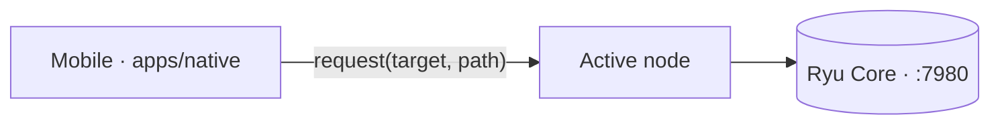

The mobile app (`apps/native`) is an [Expo](https://expo.dev) React Native build. Like every other
client it is a **thin GUI over the same Core HTTP API**, reached through the active node, not a
separate backend. The conversations, agents, and Gateway routing are Core's, so switching from the
desktop app to the phone never switches context.

The node selector decides which Core every request targets, and the shared `@ryuhq/core-client`
package supplies the actual request layer. The phone is a chooser plus a set of thin screens.

<Callout type="info">
  Mobile is partial. Chat and the drawer screens work against Core, but full desktop parity is
  pending (see [Desktop parity](/docs/mobile/parity) and `docs/mobile-parity.md`), and several
  screens still need `bunx expo install` plus a device build to exercise. On-device inference is not
  wired.
</Callout>

## Chat

Chat POSTs to `${activeNode.url}/api/chat/stream` with the selected `agent_id`
(`apps/native/app/(drawer)/ai.tsx`). The screen resolves the active node, fetches the node's agents,
and lets you pick a per-conversation agent (a `null` pick means the node's default agent). When the
node carries a token the request adds an `Authorization: Bearer` header, exactly like every other
Core call.

The same screen supports the **`/btw` side question** (`apps/native/lib/btw.ts`, POSTed to Core's
`/api/btw`). A `/btw` question asks something about the current conversation without adding to chat
history: the app holds the transcript and passes `messages`, Core sees the context, has no tools, and
returns a single ephemeral answer shown in a modal and then discarded. See
[Side Questions](/docs/core/side-questions) for the Core endpoint.

## Node selector: local or remote

A node selector (`apps/native/components/node-selector.tsx` plus `lib/node-store.ts`) picks which
Core node every request targets, so the phone can talk to a **local or a remote node**. Nodes are
`{ name, url, token }` records persisted with `expo-secure-store`, with a built-in on-device fallback
node always present as the last entry.

Selection is health-aware: `pickBestNode` probes each remote node's `GET /api/health` (3 second
timeout) and prefers the first reachable remote, falling back to the local node when the device is
offline or every remote is unreachable. See [Node and Presence](/docs/core/node-and-presence) for
how nodes and the active node work across clients.

## Drawer screens over one ListScreen scaffold

Roughly **ten drawer screens** are thin loaders over Core endpoints, built on one shared
`ListScreen` scaffold (`apps/native/components/list-screen.tsx`): node-resolve, then fetch, then
loading / error / empty states plus pull-to-refresh, with a `RowCard` row renderer. Each screen is a
thin loader plus a row renderer, so they stay close to desktop's shapes by construction.

| Screen | Core API | Notes |
|---|---|---|
| `agents.tsx` | agents | Full list |
| `skills.tsx` | skills | Full list |
| `models.tsx` | models | Full list |
| `services.tsx` | catalog / status | Read-only viewer |
| `workflows.tsx` | workflows | Full list |
| `schedules.tsx` | schedules | Full list |
| `spaces.tsx` | spaces | Full list |
| `tools.tsx` | mcp | Full list |
| `apps.tsx` | plugins | Full list |
| `meetings.tsx` | meetings | Viewer |

These ten ship alongside the pre-existing `ai`, `marketplace`, and `monitors` screens. The drawer
(`apps/native/app/(drawer)/_layout.tsx`) is config-driven and exposes Chat, Conversations, Agents,
Skills, Workflows, Schedules, Spaces, Tools, Apps, Meetings, Models, Marketplace, Services, and
Monitors.

## Push tokens for monitor alerts

Mobile registers **Expo push tokens** so monitor alerts fan out to the phone
(`apps/native/hooks/usePushRegistration.ts`). On the first active node it requests notification
permission, resolves an Expo push token, and POSTs it to Core's `/api/monitors/push-tokens` (once per
node). Push only works on a physical device with a dev or EAS build, not Expo Go on SDK 53+, and a
denied permission or missing build simply leaves push off (best-effort).

## Native OS integrations

Beyond push, the app leans into platform surfaces, all driven by chat-run status. A single
controller (`apps/native/lib/agent-activity.ts`) maps a run's lifecycle
(`running` / `waiting` / `review` / `done` / `error`) onto the right OS surface and degrades to a
no-op where that surface is unavailable, so callers never branch on platform.

| Surface | Platform | Status |
|---|---|---|
| Liquid Glass chrome | iOS 26+ | Verified |
| Ongoing-run notification | Android | Verified |
| Live Activity / Dynamic Island | iOS 16.2+ | Scaffolded (needs a Mac build) |

**Liquid Glass** wraps floating chrome (the chat composer, the drawer footer) in Apple's iOS 26
material through `GlassSurface` (`apps/native/components/glass-surface.tsx`), gated on
`isLiquidGlassAvailable() && isGlassEffectAPIAvailable()` and falling back to a styled `View`
everywhere else. **Android** shows a sticky, silent low-importance notification for the run's
duration and an alerting one when it finishes (`notifyRunFinished`).

<Callout type="warn">
  The iOS **Live Activity / Dynamic Island** path is scaffolded, not yet built: the native module
  (`apps/native/modules/ryu-live-activity/`) is present but needs a Mac to `expo prebuild` and run on
  a device. JS uses `requireOptionalNativeModule`, so it no-ops safely until that build exists.
  Remote updates while the app is killed (Core to APNs) are also not built yet.
</Callout>

## The leverage: packages/core-client

The shared client layer lives in the workspace package **`packages/core-client`**: a
platform-agnostic `client.ts` (an `ApiTarget` of `{ url, token }` plus `request` / `apiUrl` /
`makeHeaders` and an injectable buyer-token provider) plus the pure Core API modules copied verbatim
from desktop. Mobile imports them by subpath, for example
`import { fetchAgents } from "@ryuhq/core-client/agents"`.

Mobile adapts its node store to the shared client through `apps/native/lib/api-target.ts`, whose
`toTarget` is the single place the native `RyuNode` shape (`token?: string`) meets the package's
`ApiTarget` (`token: string | null`). This is the **single source that keeps mobile and desktop in
sync**: the copies are byte-identical to desktop's `lib/api`, so request and response shapes cannot
silently drift.

<Callout type="info">
  The package was migrated to the `@ryuhq` npm scope (commit `6f1662bb`), so the import path is
  `@ryuhq/core-client`, not the older `@ryu/core-client` you may see in some notes.
</Callout>

## See also

<Cards>
  <DocCard href="/docs/mobile/parity" />
  <Card
    title="Desktop"
    description="The primary Tauri surface mobile mirrors"
    href="/docs/desktop"
  />
  <Card
    title="Node and presence"
    description="How nodes and the active node work across every client"
    href="/docs/core/node-and-presence"
  />
</Cards>
