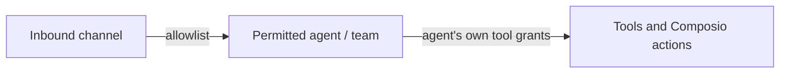

A channel (a chat surface, a bot connection, an inbound route) does not get to reach every agent or tool. Routing allowlists gate which agents a channel can address and, through that agent, which tools it can invoke. This keeps an exposed inbound channel from being a back door into your whole tool surface.

## Account-global, not node-scoped

Channel and agent routing allowlists are account-global - they apply across nodes rather than being scoped to a single node. See [Channels in the Gateway dialog](/docs/gateway/channels) for where these are configured. A channel routes to a specific agent or team, and the allowlist on that route bounds the blast radius of whatever sends into the channel.

## Composio is gateway-route-only

Composio actions are reachable only through the gateway route, never via a direct path that bypasses the allowlist. An agent's Composio actions are bound to its record, so a channel can only trigger them through an agent it is actually allowed to reach.

## How allowlists gate reach

The channel cannot pick an arbitrary agent - only one its route permits - and the agent cannot reach a tool it was not granted. The two layers compose, so widening one does not silently widen the other.

## Related

<Cards>
  <DocCard href="/docs/security/network-binding-auth" />
  <DocCard href="/docs/security/command-approval" />
  <DocCard href="/docs/gateway/channels" />
</Cards>
