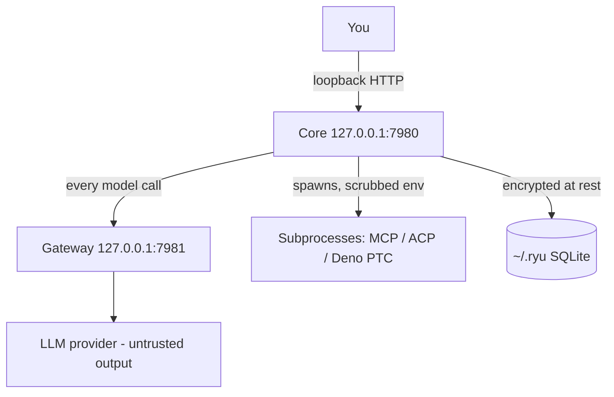

Ryu's threat model starts from one assumption - the language model is untrusted. It can be steered by prompt injection, a poisoned tool result, or a malicious document it reads. Everything downstream of the model is built to contain that.

## The boundary

- **Core and Gateway bind loopback only by default.** Nothing is reachable off-box until you set `RYU_TOKEN` and choose to expose it. See [Network binding and auth](/docs/security/network-binding-auth).
- **The LLM never receives raw secrets.** Credentials live in the identity vault (`apps/core/src/identity/`) and are injected at the execution boundary, not into the prompt. See [Credential and environment scrubbing](/docs/security/credential-scrubbing).
- **Subprocesses are the primary attack surface.** MCP servers, ACP agents, and the Deno programmatic-tool-calling sandbox run real code on your machine. They are spawned with a scrubbed environment and, for shell commands, gated by command approval. See [Sandboxing and isolation](/docs/security/sandboxing-isolation) and [Command approval](/docs/security/command-approval).
- **Data at rest is encrypted.** State under `~/.ryu/` uses SQLite with field-level encryption for sensitive columns. See [Encryption at rest](/docs/core/encryption-at-rest).

## What is NOT a boundary today

<Callout type="warn">
Ryu is single-tenant and local-first. It does not provide multi-tenant isolation, and there is no per-tab sandbox around Shadow or the desktop surfaces - everything in one install shares one trust domain. The controls here harden the boundary between you and the outside world (untrusted model output, subprocesses, the network), not between two users of the same install. Do not run an untrusted second party inside a single Ryu install and expect isolation.
</Callout>

## Related

<Cards>
  <DocCard href="/docs/security/sandboxing-isolation" />
  <DocCard href="/docs/security/command-approval" />
  <DocCard href="/docs/core/identity-vault" />
  <DocCard href="/docs/core/encryption-at-rest" />
</Cards>
