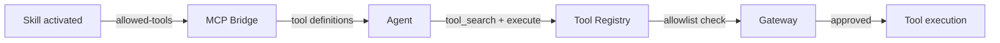
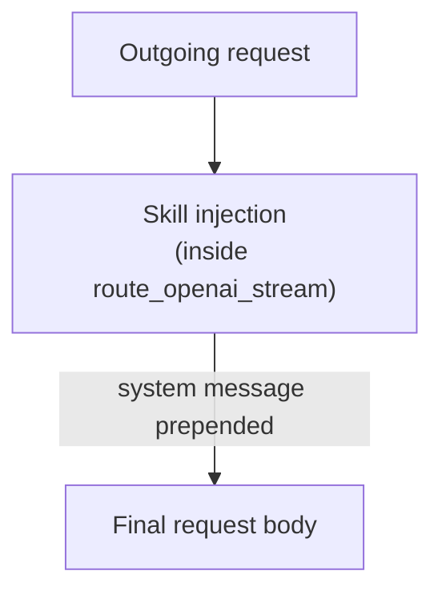

Skills are more than prompt templates — they interact with the tool system, the Gateway, and the
agent's context in specific ways. This page covers the full skills ecosystem.

## How skills interact with tools

A skill can declare that it needs specific tools via the `allowed-tools` front-matter:

```yaml
---
name: "Web Researcher"
allowed-tools:
  - "agentbrowser"
  - "spider"
---
```

When the skill is active, Core surfaces those tools to the MCP bridge for the turn. The Gateway
enforces the grant — if the plugin doesn't have `mcp:agentbrowser`, the tool is not callable.



## Progressive disclosure mechanics

Progressive disclosure keeps the context small by only injecting skill metadata up front, loading
full bodies on demand.

### The flow

1. **Selection phase:** Only each skill's `name` and `description` are injected into the system
   prompt. The model sees a list of available skills.

2. **Decision phase:** The model decides which skill is relevant to the current turn.

3. **Loading phase:** The model calls `skills__load` with the skill id. Core loads the full
   `SKILL.md` body and injects it into the context.

4. **Execution phase:** The model follows the skill's instructions, using the tools it declared.

### Why progressive disclosure matters

| Without | With |
|---|---|
| All skill bodies injected up front | Only names + descriptions up front |
| Context fills with unused instructions | Context stays small until needed |
| Weak models starved of skills they can't self-load | `always-on` escape hatch for critical skills |

### The `always-on` escape hatch

Set `always-on: true` in the front-matter to inject the full body up front:

```yaml
---
name: "Security Checker"
always-on: true
---
You MUST check every outbound request for PII before sending.
```

Use this for critical skills or models that cannot reliably self-load skills.

## Skill injection into requests

When a skill is active, Core injects it into the outgoing request body:



The injection happens **after** context trimming — the 512-token `SKILLS_RESERVE` in the context
window manager accounts for this. The Gateway counts skill-tagged calls toward budget and audit
through the `x-ryu-skill-ids` header.

## Skill-tool interaction patterns

### Pattern 1: Skill declares tools, agent uses them

```yaml
---
name: "Code Reviewer"
allowed-tools:
  - "file_read"
  - "git_diff"
---
Review the code changes in the current branch. Use git_diff to see
the changes, then file_read to inspect specific files.
```

The agent loads the skill, sees the declared tools, and uses them in sequence.

### Pattern 2: Skill provides decision logic, agent picks tools

```yaml
---
name: "Data Analyst"
description: "Decides which analysis tools to use based on data type"
---
Analyze the user's data. Choose the right tool:
- CSV data → use csv_parser
- JSON data → use json_analyzer
- Database → use sql_runner
```

The skill doesn't declare `allowed-tools` — the agent discovers tools via `tool_search` and picks
based on the skill's instructions.

### Pattern 3: Skill + turn hook

A skill provides the instructions, a turn hook provides the automation:

```json
{
  "contributes": {
    "turn_hooks": [{
      "id": "auto-review",
      "on": "post_assistant_turn",
      "code": "// Check if code was modified, trigger review"
    }]
  }
}
```

The hook fires after the assistant turn, checks if code was modified, and injects a review
follow-up if the "Code Reviewer" skill is active.

## Skill discovery by agents

Agents discover skills through the MCP bridge:

1. `skills__list` — returns all installed skills (name + description only)
2. `skills__load` — loads a specific skill's full body
3. The model decides which to load based on the current conversation

This is the progressive disclosure loop running in practice.

## Skill lifecycle

| Phase | What happens |
|---|---|
| **Install** | SKILL.md scanned from dual roots (`~/.ryu/skills/` + `apps/skills/`) |
| **Catalog** | `GET /api/skills/catalog` returns all available skills |
| **Activate** | `POST /api/skills/:id/activate` enables a skill for the agent |
| **Inject** | On each turn, active skills' metadata is injected |
| **Load** | Model calls `skills__load` → full body injected |
| **Deactivate** | `POST /api/skills/:id/deactivate` disables |

## Related

<Cards>
  <DocCard href="/docs/skills/index" />
  <DocCard href="/docs/skills/authoring" />
  <DocCard href="/docs/skills/catalog" />
  <DocCard href="/docs/core/unified-tool-catalog" />
  <DocCard href="/docs/gateway/tools" />
</Cards>
