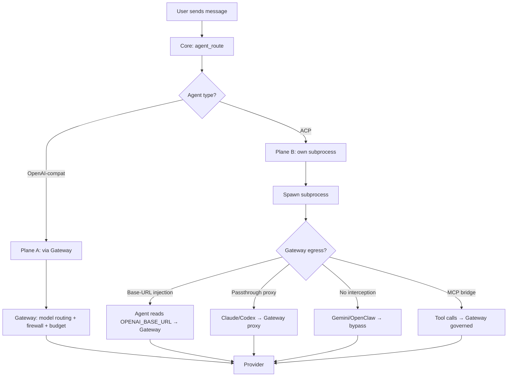

Ryu drives agents through the **Agent Client Protocol (ACP)**: each runs as a subprocess and
streams events back to Core in the Vercel AI SDK format, with a full tool loop that lets it read
files, run commands, and edit code. This page lists every agent, its gateway egress behavior,
and how to configure each one.

## Agent routing overview



## Curated first-class agents

These are hand-curated entries in `AcpAgentRegistry`. They are always available in the agent
picker (though only `ryu` is installed by default).

| ID | Canonical ID | Engine | Gateway egress | Description |
|---|---|---|---|---|
| `ryu` | `ryu` | Pi (ACP subprocess) | **Governed by default** | The flagship agent. Pi bound as engine, every call routed through the local Gateway. Default on install. Self-sufficient — manages its own Pi binary. |
| Claude Code | `acp:claude` | Claude Code (ACP subprocess) | Bypass by default; opt-in passthrough | Anthropic's coding agent. Speaks Anthropic Messages format. Subscription-preserving passthrough proxy available. |
| Codex | `acp:codex` | Codex (ACP subprocess) | Opt-in passthrough; env-injected | OpenAI's coding agent. Speaks OpenAI Responses format. Subscription-preserving passthrough proxy available. |
| Gemini CLI | `acp:gemini` | Gemini CLI (ACP subprocess) | **Bypass (not wirable)** | Google's CLI agent. Exposes no base-URL hook, so Gateway cannot intercept its LLM calls. |
| Pi | `acp:pi` | Pi Coding Agent (ACP subprocess) | Governed when routed through `ryu` | Earendilworks Pi. Minimal local coding agent. Gateway routing via env injection when used standalone. |

### Gateway egress explained

ACP agents make their own LLM calls inside their subprocess. Whether those calls traverse the
Gateway depends on the agent:

| Mechanism | Agents | How it works |
|---|---|---|
| **Base-URL injection** | `ryu`, `pi`, BYO OpenAI-compatible agents | Core injects `OPENAI_BASE_URL` pointing at the local Gateway (`/v1`). The agent's HTTP client routes through the Gateway's firewall, budget, and audit. |
| **Passthrough proxy** | Claude Code, Codex | The agent speaks its native wire format (Anthropic Messages / OpenAI Responses). The Gateway runs a transparent reverse proxy that applies request-side DLP, forwards the caller's subscription credentials unchanged, and streams the response through response-side DLP. |
| **No interception** | Gemini CLI, OpenClaw, Hermes | These agents ignore `OPENAI_BASE_URL` or use their own credential system. Their chat egress bypasses the Gateway. Tool egress is still governed via the MCP bridge. |

See [Gateway for any agent](/docs/gateway/gateway-for-any-agent) for the full wiring details.

## Registry agents (self-fetching)

Beyond the curated set, Core pulls agents from the official ACP registry
(`https://cdn.agentclientprotocol.com/registry/v1/latest`). These are dynamically fetched and
installed on demand.

### npx / uvx agents

| Registry ID | Canonical ID | Spawn command | Description |
|---|---|---|---|
| `qwen-code` | `acp:qwen` | `npx -y @qwen-code/qwen-code` | Qwen coding agent |
| `github-copilot-cli` | `acp:copilot` | `npx -y @github/copilot` | GitHub Copilot CLI |
| `codebuddy-code` | `acp:codebuddy` | `npx -y` | CodeBuddy coding agent |
| `grok-build` | `acp:grok` | `npx -y` | Grok coding agent |
| `glm-acp-agent` | `acp:glm` | `npx -y` | GLM coding agent |
| `agoragentic-acp` | `acp:agoragentic` | `npx -y` | Agora coding agent |
| `minion-code` | `acp:minion` | `npx -y` | Minion coding agent |
| `acp:cline` | `acp:cline` | `npx -y` | Cline coding agent |
| `acp:auggie` | `acp:auggie` | `npx -y` | Auggie coding agent |
| `acp:kilo` | `acp:kilo` | `npx -y` | Kilo coding agent |
| `acp:fast-agent` | `acp:fast-agent` | `npx -y` | Fast Agent |
| + any other agent on the ACP CDN | `acp:<id>` | varies | Dynamically discovered |

### Binary-only agents

These agents ship as platform-specific binaries rather than npx packages. Core fetches and
extracts them into `~/.ryu/bin` via the archive agent downloader (`apps/core/src/sidecar/agents/archive_agent/`).

| Registry ID | Canonical ID | Distribution |
|---|---|---|
| `factory-droid` | `acp:droid` | Binary |
| `goose` | `acp:goose` | Binary |
| `cursor` | `acp:cursor` | Binary |
| `opencode` | `acp:opencode` | Binary |
| `kimi` | `acp:kimi` | Binary |
| `devin` | `acp:devin` | Binary |
| + other binary agents on the ACP CDN | `acp:<id>` | Platform archive |

All registry agents carry `gateway_bypass: true` in their `AgentInfo` because they make their
own provider calls. Clients surface this so you know the egress is not seen by the Gateway.

## Local OpenAI-compatible agents

These agents run as local servers or ACP bridges and speak the OpenAI-compatible protocol:

| Engine ID | Description | Gateway egress |
|---|---|---|
| `zeroclaw` | Local OpenAI-compatible server on port 42617 | Routed through Gateway (OpenAI-compat adapter) |
| `openclaw` | OpenClaw native ACP bridge (`openclaw acp`) | Bypass (own gateway) |
| `hermes` | Hermes Agent native ACP (`hermes acp`) | Bypass (own credentials) |
| `local` | Plain-LLM fallback (any configured provider) | Routed through Gateway |

## Subscription-login agents

These agents authenticate with the user's existing subscription (OAuth), not an API key:

| Agent | Subscription | Wire format |
|---|---|---|
| `openai-codex` | ChatGPT Plus/Pro/Team | OpenAI Responses |
| `claude-pro-max` | Claude Pro/Max | Anthropic Messages |
| `github-copilot` | GitHub Copilot | OpenAI-compatible |

## Per-agent model options

Each agent engine supports specific chat models:

| Engine | Models |
|---|---|
| Claude Code | Opus, Sonnet, Fable, Haiku |
| Codex | GPT-5.1 Codex Max, GPT-5.1 Codex, GPT-5.1 |
| Gemini CLI | Gemini 2.5 Pro, Gemini 2.5 Flash |
| Pi | Default (configurable via `RyuPiConfig`) |
| Hermes | Hermes 3 |
| Ryu / Local | Gemma 4 E2B (default), any installed model |

## The agents catalog

Onboarding detects which agent CLIs you already have on PATH and offers to add the matching
agent. Only `ryu` is installed by default; every other agent is opt-in.

| Action | Endpoint |
|---|---|
| List the installable catalog | `GET /api/agents/catalog` |
| Add a catalog agent to the picker | `POST /api/agents/catalog/install` |
| Remove a catalog agent | `POST /api/agents/catalog/uninstall` |
| List installed agents | `GET /api/agents` |

## Agent-auto routing (Plane B)

The universal agent picker includes an **"Auto"** entry that resolves the concrete agent per
turn from your rules. It uses the same strategy vocabulary as smart routing (`llm` /
`embedding` / `keyword`), but the rule targets are agent IDs, not model IDs.

```jsonc
{
  "enabled": true,
  "strategy": "embedding",
  "rules": [
    { "description": "writing, refactoring or debugging code", "agent_id": "claude-code" },
    { "description": "quick web lookups and browsing",         "agent_id": "ryu" },
    { "description": "long-form research and analysis",         "agent_id": "gemini" }
  ],
  "default_agent_id": "ryu"
}
```

When Auto picks a different harness than last turn, the previous agent's session is kept
warm for switch-back, and conversation history is replayed into the new agent as prior
context. Live in-subprocess state (open files, working buffers) is not transferred.

See [Routing](/docs/gateway/routing#agent-auto-plane-b-picking-the-agent) for the full
configuration and the three "auto"s disambiguation.

## Related

<Cards>
  <DocCard href="/docs/desktop/engines/agent-runtimes" />
  <DocCard href="/docs/gateway/gateway-for-any-agent" />
  <DocCard href="/docs/gateway/routing-planes" />
  <DocCard href="/docs/start-here/architecture/core-vs-gateway" />
</Cards>
