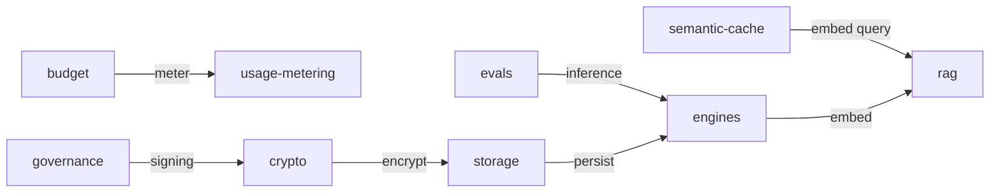
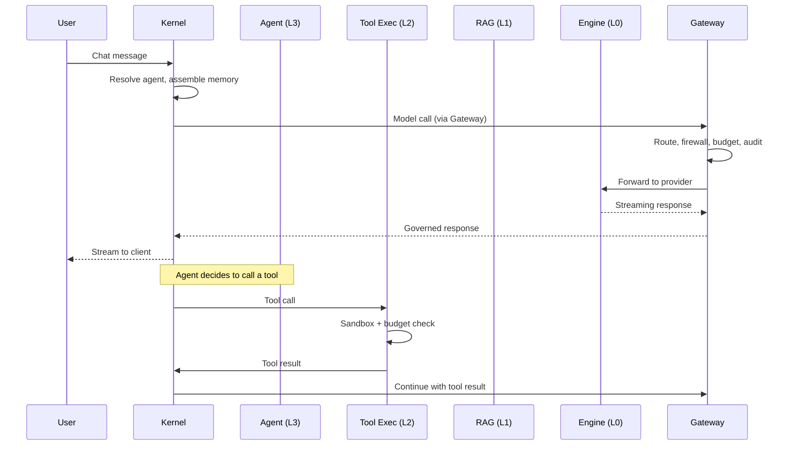

Ryu decomposes into **~40 self-contained capability packages** organized in layers. Each layer
depends only on layers below it, forming a directed acyclic graph (DAG) with no cycles. The kernel
/Core sits above everything as the orchestrator; the Gateway governs model calls across all layers.

This page is the master map of every capability, which layer it belongs to, and how the layers
connect. Use it to understand where any feature lives and what it depends on.

## The layer model

```mermaid
flowchart TB
  subgraph Kernel["Ryu Core (kernel)"]
    K1["Session / chat loop"]
    K2["Runnable registry + lifecycle"]
    K3["Sidecar manager"]
    K4["Auth / identity"]
    K5["Gateway shell"]
    K6["Scheduler"]
  end

  subgraph L0["L0 — Primitives"]
    L0S["storage"]
    L0C["crypto"]
    L0E["engines / inference"]
    L0D["downloads"]
    L0V["vault / credentials"]
  end

  subgraph L1["L1 — Feature Primitives"]
    L1RAG["rag"]
    L1TTS["tts"]
    L1STT["stt"]
    L1VAD["vad"]
    L1IMG["image"]
    L1COLLAB["collab"]
    L1RT["realtime"]
    L1WS["workspace"]
    L1SB["sandbox"]
    L1WH["webhook-ingress"]
    L1MESH["mesh"]
    L1USG["usage-metering"]
    L1EMAIL["email-send"]
  end

  subgraph L2["L2 — Higher-Level Features"]
    L2MEM["memory"]
    L2SP["spaces"]
    L2RET["retrieval"]
    L2SRCH["search"]
    L2KN["knowledge / okf"]
    L2TR["tool-registry"]
    L2TE["tool-exec"]
    L2MCP["mcp-registry"]
    L2MCAT["model-catalog"]
    L2COMP["composio"]
    L2ID["identity / persona"]
    L2ACT["activity"]
    L2TRACE["tracing"]
    L2SYNC["sync"]
  end

  subgraph Lg["Lg — Gateway"]
    LgPROV["providers"]
    LgRTR["router"]
    LgCACHE["cache"]
    LgSCACHE["semantic-cache"]
    LgFW["firewall"]
    LgBUD["budget"]
    LgRL["rate-limit"]
    LgCB["circuit-breaker"]
    LgEVAL["evals"]
    LgAUD["audit"]
    LgPASS["passthrough"]
    LgCH["channels"]
    LgGOV["governance / policy"]
    LgTOOL["gateway-tools"]
  end

  subgraph L3["L3 — Apps (already app-ized)"]
    L3MTG["meetings"]
    L3MON["monitors"]
    L3QST["quests"]
    L3APR["approvals"]
    L3HEAL["healing"]
    L3LRN["learning"]
    L3WF["workflows"]
    L3RES["research"]
    L3DASH["dashboards"]
    L3REC["recipes"]
    L3TMS["teams"]
    L3SKL["skills"]
    L3MAIL["mail"]
    L3FIN["finetune"]
    L3HW["hardware"]
    L3PRED["predict"]
    L3VOICE["voice-mode"]
    L3CLIP["clips"]
    L3GHOST["ghost"]
    L3SHADOW["shadow"]
    L3SPIDER["spider"]
    L3BROWSER["agentbrowser"]
  end

  L0 --> Kernel
  L1 --> L0
  L2 --> L1
  L3 --> L2
  Lg --> L0

  Kernel --> Lg
  Kernel --> L3
```

## Cross-tier dependencies

The DAG has a few cross-tier edges that break the strict layering (but never create cycles):

The backbone is `crypto → storage → engines → rag`. Everything else flows from or through these.

## L0 — Primitives

The foundation layer. These are pure infrastructure with no domain logic. Every other layer
depends on at least one L0 primitive.

| Package | What it does | Consumers |
|---|---|---|
| `ryu-storage` | File and blob storage abstraction (local disk, S3-compatible) | Everything |
| `ryu-crypto` | Encryption at rest, key derivation, manifest signing | Everything, Gateway governance |
| `ryu-engines` | Inference engine lifecycle (spawn, health, model loading) | L1 RAG, L2 model-catalog, Gateway providers |
| `ryu-downloads` | Checksum-verified download pipeline with resumption | Sidecar manager, model catalog |
| `ryu-vault` | Credential storage and rotation | Gateway auth, provider keys |

## L1 — Feature Primitives

Domain-specific capabilities that are still low-level enough to be building blocks. Each is a
single concern, independently testable, and swappable via the capability broker.

| Package | What it does | Key consumers |
|---|---|---|
| `ryu-rag` | Embedding, vector storage, and retrieval | L2 spaces, L2 retrieval, L2 search |
| `ryu-tts` | Text-to-speech synthesis | L3 voice-mode, L3 meetings |
| `ryu-stt` | Speech-to-text transcription | L3 voice-mode, L3 meetings |
| `ryu-vad` | Voice activity detection (per-frame, hot path) | L3 voice-mode, realtime |
| `ryu-image` | Image generation and manipulation | L3 workflows, chat |
| `ryu-collab` | Real-time collaborative editing | L2 spaces, desktop |
| `ryu-realtime` | WebSocket/RTC streaming | Chat, voice-mode |
| `ryu-workspace` | Git workspace (worktree, diff, apply) | L3 workflows, desktop |
| `ryu-sandbox` | Code execution sandbox (wasmtime, Docker) | L2 tool-exec, L3 workflows |
| `ryu-webhook-ingress` | Public webhook endpoint routing | L3 workflows, L3 monitors |
| `ryu-mesh` | Tailscale/Headscale mesh networking | Multi-node, CLI |
| `ryu-usage-metering` | Token and request counting | Gateway budgets, billing |
| `ryu-email-send` | SMTP/email transport | L3 mail, notifications |

### VAD note

`ryu-vad` is a hot per-frame primitive that must never be IPC-bound. It runs in-process on every
audio frame for low-latency voice detection. This is a deliberate exception to the sidecar
pattern — latency matters more than isolation here.

## L2 — Higher-Level Features

Composed from L1 primitives. These are the features that end users interact with indirectly
(through agents, workflows, or the desktop).

| Package | What it does | Depends on |
|---|---|---|
| `ryu-memory` | Long-term conversation memory and recall | L1 rag, L0 storage |
| `ryu-spaces` | Knowledge spaces with documents and GraphRAG | L1 rag, L1 workspace |
| `ryu-retrieval` | Document ingestion and chunk retrieval | L1 rag, L0 storage |
| `ryu-search` | Semantic and keyword search across all data | L1 rag, L2 retrieval |
| `ryu-knowledge` | OKF (Open Knowledge Format) catalog and import | L2 retrieval, L0 storage |
| `ryu-tool-registry` | Unified tool catalog and description | L0 storage |
| `ryu-tool-exec` | Tool execution sandbox and budget | L1 sandbox, Gateway exec-budget |
| `ryu-mcp-registry` | MCP server discovery and connection | L2 tool-registry, L1 realtime |
| `ryu-model-catalog` | Model registry, install, and device-fit | L0 engines, L0 downloads |
| `ryu-composio` | Composio action backend integration | L2 tool-exec, Gateway |
| `ryu-identity` | Agent persona and identity management | L0 crypto, L0 storage |
| `ryu-activity` | Activity logging and timeline | L0 storage |
| `ryu-tracing` | OpenTelemetry traces and spans | L0 storage |
| `ryu-sync` | Cross-device state synchronization | L0 storage, L1 mesh |

## Lg — Gateway

The Gateway layer runs as a separate process and governs every model call. Its packages are
logically independent of the Core layers (L0-L2) but share L0 primitives.

| Package | What it does | Cross-tier edge |
|---|---|---|
| `providers` | Provider registry and connection pooling | — |
| `router` | Model-to-provider resolution (exact, prefix, default) | — |
| `cache` | Exact-match response caching | — |
| `semantic-cache` | Embedding-based similar-query caching | → L1 rag (embedder) |
| `firewall` | PII/DLP, prompt-injection detection, moderation | — |
| `budget` | Per-user, per-agent, per-session token budgets | → L1 usage-metering |
| `rate-limit` | Request and token rate limiting | — |
| `circuit-breaker` | Per-provider failure detection and failover | — |
| `evals` | Evaluation runner and scoring | → L0 engines (inference) |
| `audit` | Per-request audit trail | — |
| `passthrough` | Subscription-preserving proxy for Claude Code/Codex | — |
| `channels` | Telegram, Slack, WhatsApp, Discord adapters | — |
| `governance` | Manifest signing, grant validation, policy | → L0 crypto |
| `gateway-tools` | Unified tool search and execution front | — |

## L3 — Apps

The top layer. Each app is a self-contained package with its own `manifest.json` manifest, backend
(or sidecar), optional UI companion, and tests. Apps are installed, enabled, disabled, and
updated independently through the plugin lifecycle.

| App | What it does | Key L1/L2 dependencies |
|---|---|---|
| `meetings` | Meeting capture, transcription, and notes | stt, tts, memory |
| `monitors` | Website monitors (price, stock, keyword, content, uptime) | webhook-ingress, mesh |
| `quests` | Auto-detecting todos and task management | memory, activity |
| `approvals` | Human-in-the-loop approval queue | memory, notifications |
| `healing` | Self-healing and auto-recovery | activity, mesh |
| `learning` | Continual learning and skill synthesis | memory, rag |
| `workflows` | DAG workflow engine with durable execution | workspace, sandbox, tool-exec |
| `research` | Deep research and analysis | rag, search, memory |
| `dashboards` | Configurable widget dashboards | activity, storage |
| `recipes` | Desktop automation recording and replay | ghost, workspace |
| `teams` | Multi-user team management | identity, storage |
| `skills` | Agent skill authoring and management | rag, storage |
| `mail` | Agent Inboxes (email-as-a-service) | email-send, identity |
| `finetune` | LoRA/QLoRA fine-tuning | engines, storage |
| `hardware` | Physical device pairing and control | mesh, realtime |
| `predict` | System-wide predictive typing | engines |
| `voice-mode` | Real-time voice conversation | tts, stt, vad, realtime |
| `clips` | Screen/audio capture and context | realtime, storage |
| `ghost` | Desktop automation MCP server | workspace |
| `shadow` | Screen/audio capture + semantic memory | rag, storage |
| `spider` | Web scraping | — |
| `agentbrowser` | Web browsing | — |

## How the layers connect at runtime

When a user sends a chat message, here is how the layers participate:

## The permanent kernel

Not everything decomposes. Some modules are permanent kernel residents because they are
needed by everything and would create circular dependencies if extracted:

| Module | Why it stays |
|---|---|
| Session / chat loop | The core runtime; every request flows through it |
| Runnable registry + lifecycle | Discovers, resolves, and activates all other layers |
| Sidecar manager | Manages L0 engine processes |
| Auth / identity | Needed by every authenticated endpoint |
| Gateway shell | Starts and configures the Gateway sidecar |
| Scheduler | Needed by workflows, monitors, and periodic tasks |
| Notifications | 4 dispatch shapes (inbox, toast, push, channel) — not a single capability |
| ~30 UTIL modules | Small helpers (hashing, ID generation, time parsing) that are not worth extracting |

The estimated end-state kernel is **~40-50k LoC** (down from ~195k total today).

## Related

<Cards>
  <DocCard href="/docs/start-here/architecture/platform-decomposition" />
  <DocCard href="/docs/start-here/architecture/decomposition-program" />
  <DocCard href="/docs/start-here/architecture/runnable-model" />
  <DocCard href="/docs/start-here/architecture/core-vs-gateway" />
</Cards>
