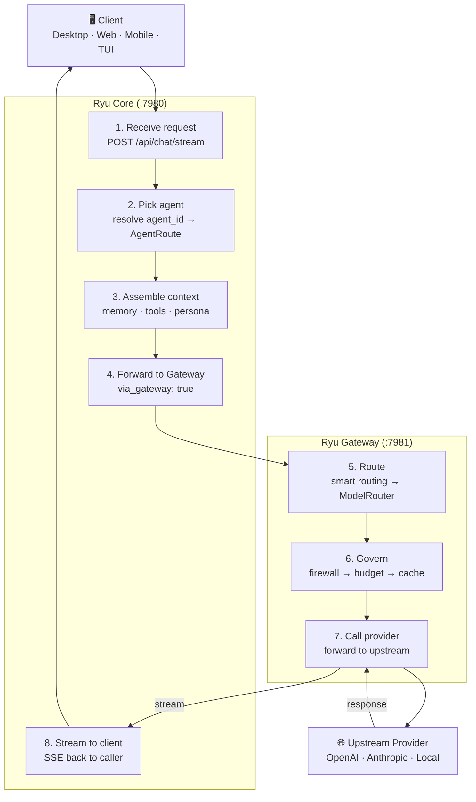
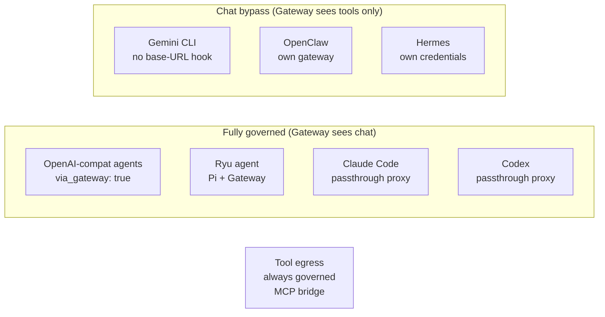

Ryu has two Rust services, and one rule decides which one any given feature belongs to.

- If code decides **what runs** (which agent, session, workflow, or tool), it is **Core**.
- If code decides **what is allowed, shared, measured, or paid for** (security, routing, registry,
  evals, budgets, org policy, audit), it is **Gateway**.

Core never enforces policy inline. It routes every model call through the Gateway. The Gateway is
the shared part a team adopts and an enterprise buys.

## Why the split matters

The Gateway is the moat. Agents are commoditized; the control layer around them is not. Keeping
all policy in one place means:

- A single chokepoint governs every model call — firewall, PII/DLP, budgets, audit.
- The same Gateway can front any engine or any third-party agent framework with no code change.
- Core stays a clean orchestration layer that is easy to open-source and self-host.

## How a request flows

A default chat request travels through both services:

### Step by step

1. A client calls Core `POST /api/chat/stream` (`apps/core/src/server/mod.rs`).
2. Core decides what runs: it picks the agent, assembles short-term and long-term memory,
   injects allowlisted tools, and selects an adapter.
3. For the default OpenAI-compatible route, Core forwards the model call to the Gateway with
   `via_gateway: true` (`apps/core/src/sidecar/adapters/mod.rs`). Core does not authenticate to its
   own Gateway; it points at the local Gateway URL.
4. The Gateway applies routing, firewall, budgets, caching, and audit, then calls the upstream
   provider.
5. The response streams back through Core to the client.

Core manages the Gateway as a sidecar (`apps/core/src/sidecar/gateway.rs`). On spawn, Core passes
the Gateway a `--bind` derived from `RYU_GATEWAY_URL` and sets `LOCAL_LLM_URL` so the active local
engine is a routable provider.

## What lives where

| Concern | Service | Where |
|---|---|---|
| Chat routing and the agent tool loop | Core | `apps/core/src/sidecar/adapters/` |
| Sessions, conversations, memory | Core | `apps/core/src/server/` |
| Spaces (RAG), retrieval | Core | `apps/core/src/server/spaces.rs`, `retrieval.rs` |
| Workflows, delegation, scheduler | Core | `apps/core/src/workflow/`, `scheduler/` |
| Sidecar lifecycle, model and skill catalogs | Core | `apps/core/src/sidecar/`, `model_catalog/`, `skills_catalog/` |
| Capability broker + binding registry | Core | `apps/core/src/plugins/binding.rs` |
| Plugin lifecycle (install/enable/disable) | Core | `apps/core/src/plugins/` |
| Model routing and fallback | Gateway | `apps/gateway/src/router/` |
| Firewall, PII/DLP, prompt-injection | Gateway | `apps/gateway/src/firewall/` |
| Caching, rate limiting, circuit breaker | Gateway | `apps/gateway/src/cache/`, `rate_limit/`, `circuit_breaker/` |
| Budgets, evals, audit | Gateway | `apps/gateway/src/budget/`, `evals/`, `audit/` |
| Passthrough proxy (Claude Code, Codex) | Gateway | `apps/gateway/src/passthrough/` |
| Unified tool surface | Gateway | `apps/gateway/src/tools/` |

## The known bypass

ACP agents (Claude Code, Codex, Gemini CLI, and friends) run as subprocesses that make their own
provider calls internally. Core cannot intercept those calls, so ACP egress does **not** traverse
the Gateway today.

The default OpenAI-compatible route and the `ryu`, `pi`, and `codex` ACP agents do route through the
Gateway. Closing the remaining ACP and registry bypass is tracked as ongoing work. When you need
firewall, budget, and audit coverage to be absolute, use a gateway-routed agent.

<Callout type="info">
  The Gateway is already on the default chat path. The remaining Gateway work is moat **surfaces**
  (firewall, PII/DLP, and budget configuration UIs) and closing the ACP egress bypass, not the
  data-plane wiring.
</Callout>

## Related

<Cards>
  <DocCard href="/docs/gateway/routing-planes" />
  <DocCard href="/docs/gateway/gateway-for-any-agent" />
  <DocCard href="/docs/start-here/architecture/runnable-model" />
  <DocCard href="/docs/start-here/architecture/capability-layers" />
</Cards>
