Ryu is undergoing a systematic decomposition from a monolithic Core (~143k LoC after extraction) into ~40
self-contained capability packages. This page documents the program: the waves, the acceptance
criteria, what has been extracted, and what stays in the kernel permanently.

For the capability layer model (L0-L3 + Lg), see [Capability Layers](/docs/start-here/architecture/capability-layers).

## The definition of "decomposed"

A module counts as decomposed when **any one** of these is true:

1. **Own package** — code has moved to its own crate (`crates/core/*`, `crates/gateway/*`) or app directory (`apps-store/<app>/`)
2. **Own TS package + shell page deleted** — the frontend component lives in its own package and the old monolithic page is gone
3. **Adjudicated KERNEL or UTIL** — a written reason explains why this module stays in Core (e.g., "hot per-request primitive", "circular dependency risk")

100% decomposition = every row in the master disposition map is in state 1, 2, or 3.

## The extraction waves

Work proceeds in waves, each building on the previous. Waves are ordered by dependency — lower
layers are extracted first so higher layers can depend on them.

```mermaid
flowchart LR
  W0["W0\nRoot workspace\nRaw-route gaps"]
  W1["W1\nTracer moves\nquests, recipes, clips"]
  W15["W1.5\nLayout normalization\napps-store/ structure"]
  W2["W2\nL0 primitives\nstorage, crypto, engines,\ndownloads, vault"]
  W3["W3\nL1 primitives\nrag, tts, stt, vad, image,\ncollab, realtime, workspace,\nsandbox, webhook, mesh,\nusage"]
  W4["W4\nL2 features\nmemory, spaces, retrieval,\nsearch, knowledge, tool-registry,\ntool-exec, mcp-catalog,\nmodel-catalog, composio,\nactivity, tracing"]
  W5["W5\nL3 apps to sidecars\nmeetings, monitors, approvals,\nlearning, healing, research,\nteams, dashboards, skills,\nhardware, workflows, predict,\nvoice, finetune"]
  W6["W6\nGateway trait inversion\nopen ProviderKind, config-driven\nset_active, firewall/DLP/router\ninversion to traits, stage crates"]
  W7["W7\nFrontend extraction\n7 tracer companions, 3 medium.\nNative WebViewExtensionHost.\nUI-layer: @ryu/ui + tailwind"]
  W8["W8\nPlatform tier\nextension host runtime, versioned\nhost API, dev loop, activation\nevents, grant consent, shadcn-style\nUI registry"]
  W9["W9\nBrowser app\napps-store/browser/ with\nElectron sidecar + real\nChromium + CDP"]

  W0 --> W1 --> W15 --> W2 --> W3 --> W4 --> W5
  W5 --> W6 --> W7 --> W8 --> W9
```



### Wave details

| Wave | Scope | Effort | Status |
|---|---|---|---|
| **W0** | Root virtual workspace, close raw-route gaps | ~2-3 days | Done |
| **W1** | Tracer extractions: `crates/core/quests`, `recipes`, `clips` | ~3-5 days | Done |
| **W1.5** | Layout normalization to `apps-store/<app>/{plugin.json, backend/, sidecar/, ui/, tests/}` | ~1 day | Done |
| **W2** | L0 primitives: `storage`, `crypto`, `engines`, `downloads`, `vault` | ~2-3 weeks | Done |
| **W3** | L1 primitives: 13 packages (rag, tts, stt, vad, image, collab, realtime, workspace, sandbox, webhook-ingress, mesh, usage-metering, email-send) | ~2-3 weeks | Done |
| **W4** | L2 features: 14 packages (memory, spaces, retrieval, search, knowledge, tool-registry, tool-exec, mcp-catalog, model-catalog, composio, identity, activity, tracing, sync) | ~2-3 weeks | Done |
| **W5** | L3 apps to sidecars: all 11 feature apps (mail, teams, research, clips, finetune, quests, healing, monitors, dashboards, meetings, recipes) are now out-of-process | ~2-3 weeks | Done |
| **W6** | Gateway: open `ProviderKind`, config-driven `set_active`, invert firewall/DLP + router + smart-router + passthrough to traits, stage crates | ~2 weeks | In progress |
| **W7** | Frontend: 7 tracer companions, 3 medium extractions, Native WebViewExtensionHost, UI-layer (`@ryu/ui` + tailwind preset as build-time deps, theme token bridge) | ~1-2 weeks | Not started |
| **W8** | Platform: extension host runtime, versioned host API, dev loop, activation events, grant consent, shadcn-style UI registry, file-based definition distribution | ~1-2 months | In progress |
| **W9** | Browser app: `apps-store/browser/` with Electron sidecar + real Chromium + CDP, `browser.control` capability | ~2-3 weeks | In progress |

**Total effort:** Multi-month program. W0-W1 are quick wins; W2-W4 are the bulk of the extraction;
W5-W9 are the platform and frontend layers.

## What has been extracted (verified)

| Track | What | Pattern | Commits |
|---|---|---|---|
| **Track A** | Capability broker + binding registry | Gate-not-move + contracts crate | `efebde82` → `1bcc47ca` |
| **Track B** | RAG engines graph | Cfg-gate | `4db69a4c`, `07824d2c`, `1f3fb5f0` |
| **Track C** | Mail (`com.ryu.mail`) as first manifest-driven app | Out-of-process sidecar | `e15d5bea` |
| **Track D** | Surface mounting (web, native, TUI) for sandboxed app UIs | Gate-not-move | decompo-2026-07-16 |
| **Track E** | Desktop UI extraction (monitors, workflows canvas) | Companion packages | decompo-2026-07-16 |

## The six proven patterns

Every extraction wave uses one or more of these mechanical patterns:

### 1. Gate-not-move

Instead of physically extracting code, gate access behind a trait or config key. The old code
stays in Core but is only callable through the new abstraction. Verify the new path works
before moving code.

### 2. Cfg-gate

Feature-flag the old and new code paths. Ship both, default to the old, flip the flag in CI
to test the new. Roll back by flipping the flag, not by reverting code.

### 3. Out-of-process sidecar

Spawn the capability as a separate process. Core communicates over HTTP or a local socket.
The sidecar owns its own state, binary, and release cycle. Core downloads, checksum-verifies,
starts, and health-checks it.

### 4. Contracts crate

Extract shared types into a pure-data crate (`crates/core/kernel-contracts`). Both Core and
apps depend on the contracts crate, so neither can drift from the wire format.

### 5. Verify-every-wave

Each wave ships with an integration test suite (`crates/testing/integration`) that proves
the old path still works and the new path produces identical results. A wave is not done
until the tests pass.

### 6. Adversarial verification

After each wave, a separate agent reviews the diff for logic changes, accidental coupling,
and missed callers. The reviewer is a different model than the one that wrote the code.

## The permanent kernel

These modules are permanent kernel residents. They will never be extracted because they are
needed by everything or would create circular dependencies:

| Module | Why it stays | Estimated LoC |
|---|---|---|
| Session / chat loop | Core runtime; every request flows through it | ~8k |
| Runnable registry + lifecycle | Discovers, resolves, and activates all layers | ~5k |
| Sidecar manager | Manages L0 engine processes | ~4k |
| Auth / identity | Needed by every authenticated endpoint | ~3k |
| Gateway shell | Starts and configures the Gateway sidecar | ~2k |
| Scheduler | Needed by workflows, monitors, and periodic tasks | ~3k |
| Notifications | `ryu-notify` (kernel crate) — extracted from monitors app, shared delivery layer |
| ~30 UTIL modules | Small helpers not worth extracting | ~10k |
| **Total** | | **~37k** |

The estimated end-state kernel is **~40-50k LoC** (down from ~143k today after extraction).

## What stays in Core by design

Some modules are deliberately not decomposed:

| Module | Reason |
|---|---|
| Notifications | 4 dispatch shapes (inbox, toast, push, channel) — not a single capability |
| Scheduler | Kernel subsystem needed by workflows, monitors, and periodic tasks |
| L0/L1/L2 primitives (today) | Consumers are still in-crate; extraction happens in W2-W4 |
| Hot per-request primitives (e.g., VAD) | Latency matters more than isolation; must stay in-process |

## Acceptance criteria per wave

A wave is accepted when:

1. **All tests pass** — `cargo check`, `cargo test`, lean build, and the integration test suite
2. **No logic changes** — the adversarial reviewer confirms no behavioral drift
3. **Old paths still work** — existing callers are unmoved or migrated in the same wave
4. **New paths produce identical results** — the integration tests prove functional equivalence
5. **Build compiles** — both default and lean builds succeed
6. **Runtime smoke** — `RYU_PROFILE=auditsmoke` passes on a real node

## Verification commands

```bash
# Full build + test
cargo check --workspace
cargo test --workspace

# Lean build (minimal features)
cargo check --workspace --no-default-features

# Runtime smoke
RYU_PROFILE=auditsmoke cargo run --manifest-path apps/core/Cargo.toml

# Integration tests
cargo test -p ryu-integration-tests
```

## Current state (as of 2026-07-18)

The full app sidecar-ization is **complete**. All 11 feature-app backends now serve their `/api/*`
surface out-of-process (`mail`·`teams`·`research`·`clips`·`finetune`·`quests`·`healing`·`monitors`·
`dashboards`·`meetings`·`recipes`). Of those, 7 link zero crate code in Core while 4 keep a
non-optional path-dep for a welded kernel path. Core has shrunk from ~195k to ~143k LoC (~87% of
non-kernel Core now lives in capability packages).

The decomposition infrastructure is built and the extraction is substantially complete. Remaining
work is on the Gateway trait inversion (W6), frontend extraction (W7), platform tier (W8), and
browser app (W9).

## Related

<Cards>
  <DocCard href="/docs/start-here/architecture/capability-layers" />
  <DocCard href="/docs/start-here/architecture/platform-decomposition" />
  <DocCard href="/docs/start-here/architecture/core-vs-gateway" />
  <DocCard href="/docs/develop/extensions/plugin-json-manifest" />
</Cards>
