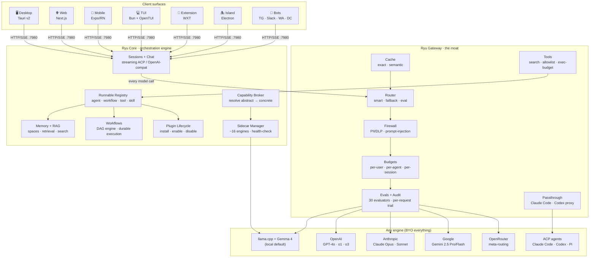
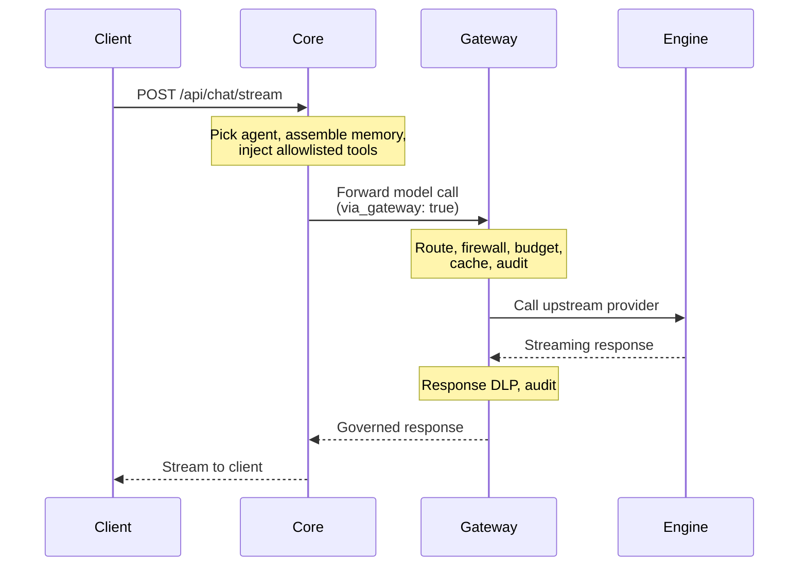
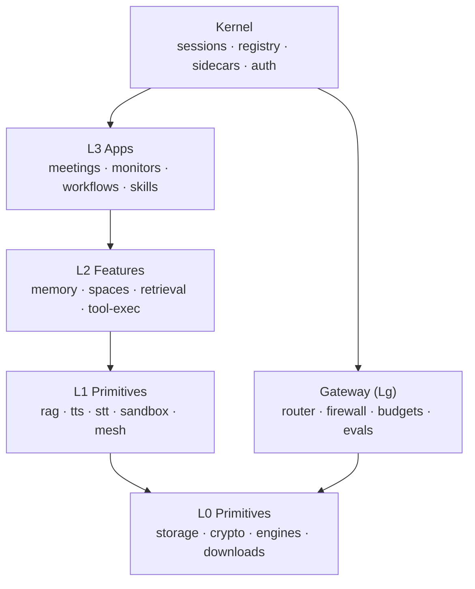
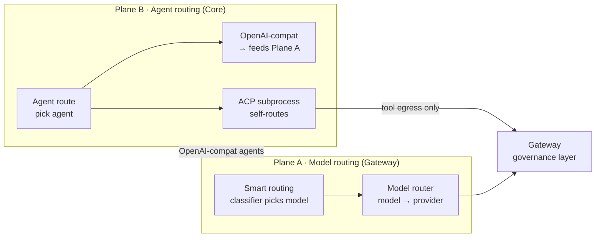
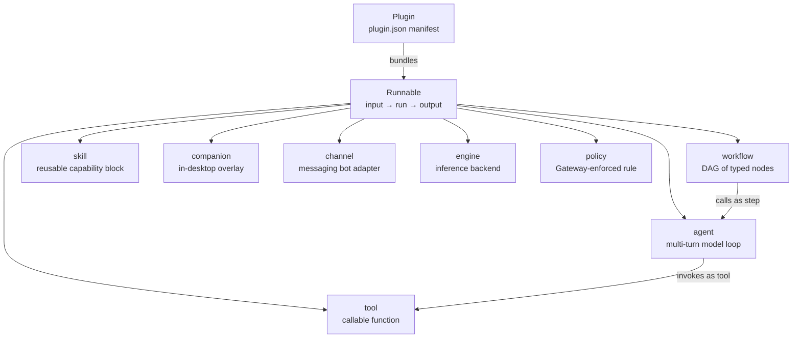

Ryu is **the whole car built around AI agent engines**: the engines already exist (OpenAI, Claude
Code, Gemma, any OpenAI-compatible runtime), and Ryu is the orchestration and control layer around
them. This is the one-page map; every box on the diagram has its own deeper section.

## The full architecture

## The single most important rule

Two Rust services do the work: **Ryu Core** (`apps/core`, default `127.0.0.1:7980`) and **Ryu
Gateway** (`apps/gateway`). They are split by one rule:

- If code decides **what runs** (which agent, session, workflow, or tool) it is **Core**.
- If code decides **what is allowed, shared, measured, or paid for** (security, routing, registry,
  evals, budgets, org policy, audit) it is **Gateway**.

Core never enforces policy inline. It routes every model call through the Gateway. The Gateway is
the shared part a team adopts and an enterprise buys.

## How one request flows

A request from any client travels down through Core (which decides what runs), into the Gateway
(which governs the model call), out to an engine, and back.

## The capability layer model

Ryu decomposes into ~40 self-contained packages in layers (L0-L3 + Gateway). Each layer
depends only on layers below it, forming a DAG with no cycles.

See [Capability Layers](/docs/start-here/architecture/capability-layers) for the full map.

## The two routing planes

Ryu has two distinct routing mechanisms:

- **Plane A (Model routing)** — Gateway picks *which LLM* one completion uses. Smart routing
  (classifier/embedding/keyword) rewrites `body["model"]`, then `ModelRouter::route` maps
  model to provider.
- **Plane B (Agent routing)** — Core picks *which agent* serves the turn. OpenAI-compat agents
  feed Plane A (governed); ACP agents self-route (only tool egress governed via MCP bridge).

See [Routing planes](/docs/gateway/routing-planes) for the full walkthrough.

## The Runnable model

Everything Ryu executes is a **Runnable** — one contract with input, run, and output. The
eight kinds are peers, not a hierarchy.

See [The Runnable model](/docs/start-here/architecture/runnable-model) for the full vocabulary.

## Where to go next

<AutoCards url="/docs/start-here/architecture" />

<Callout type="info">
  The boxes above each have their own realm. [Core](/docs/core) and [Gateway](/docs/gateway) hold
  the full subsystem reference; [Engines](/docs/desktop/engines) covers the swappable runtimes
  Core manages as sidecars.
</Callout>
