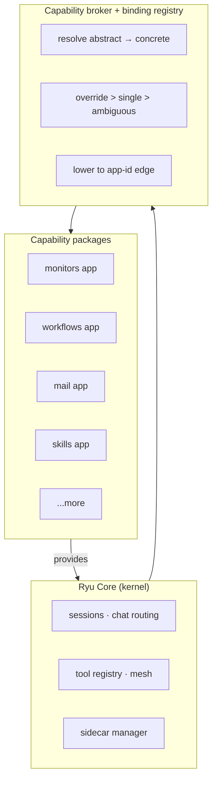
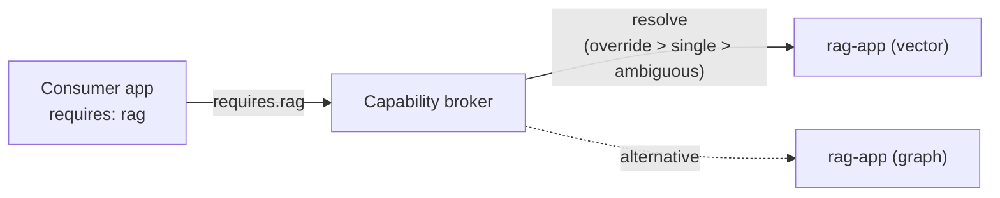
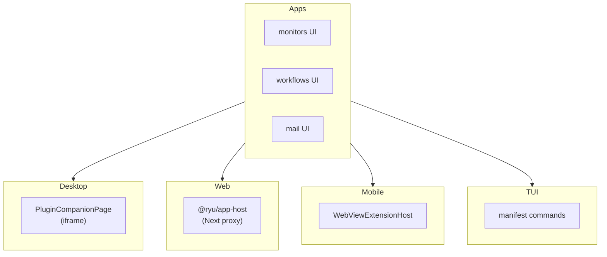

Ryu's long-term architecture is a **minimal kernel plus self-contained sandboxed app/capability
packages** — the "iPhone of AI" model. The Core kernel handles orchestration, sessions, and chat
routing; everything else is a swappable package that the kernel discovers, resolves, and runs.

This page explains the decomposition model, the proven patterns, and what has been extracted so far.
For the full capability layer hierarchy, see [Capability Layers](/docs/start-here/architecture/capability-layers).
For the extraction waves and effort estimates, see [Decomposition Program](/docs/start-here/architecture/decomposition-program).

## The vision



Each app is a directory under `apps-store/<app>/` containing:

| File | Purpose |
|---|---|
| `plugin.json` | Manifest declaring runnables, permissions, sidecars, and activation events |
| `backend/` | Sidecar binary crate (or library crate) |
| `sidecar/` | Optional external sidecar process |
| `ui/` | Companion package (plain HTML/CSS, no `@ryu/ui` dependency) |
| `tests/` | Integration and unit tests |

## The six proven patterns

The decomposition uses a small set of mechanical patterns, applied consistently:

### 1. Gate-not-move

Instead of physically extracting code, gate access behind a trait or config key. The old code
stays in Core but is only callable through the new abstraction. This lets you verify the new
path without a risky big-bang move.

### 2. Cfg-gate

Feature-flag the old and new code paths. Ship both, default to the old, flip the flag in CI
to test the new path. Roll back by flipping the flag, not by reverting code.

### 3. Out-of-process sidecar

Spawn the capability as a separate process. Core communicates over HTTP or a local socket. The
sidecar owns its own state, its own binary, and its own release cycle. Core downloads,
checksum-verifies, starts, and health-checks it.

### 4. Contracts crate

Extract the shared types into a pure-data crate (`crates/ryu-kernel-contracts`). Both Core and
the app depend on the contracts crate, so neither can drift from the wire format.

### 5. Verify-every-wave

Each extraction wave ships with an integration test suite (`crates/ryu-integration-tests`) that
proves the old path still works and the new path produces identical results. A wave is not done
until the tests pass.

### 6. Adversarial verification

After each wave, a separate agent reviews the diff for logic changes, accidental coupling, and
missed callers. The reviewer is a different model than the one that wrote the code.

## The capability broker

The capability broker (`apps/core/src/plugins/binding.rs`) resolves abstract capability
requirements to concrete provider apps.

A plugin declares:

```json
{
  "requires": { "capabilities": ["rag"] },
  "provides": [
    {
      "capability": "rag",
      "version": "1.0",
      "sidecar": "rag-sidecar",
      "route": "/api/rag/*",
      "grant": "sidecar:process"
    }
  ]
}
```

The registry resolves this to a concrete provider app using the priority:

1. **Override** — an explicit user override wins.
2. **Single provider** — if only one app provides the capability, use it.
3. **Ambiguous** — if multiple providers exist and no override is set, refuse with an error message listing the candidates.

The broker then lowers the abstract edge to a bare app-id edge so the existing dependency
graph handles enable/disable/cycle detection unchanged.



## What has been extracted

### Done (shipped and verified)

| Track | What was extracted | Pattern used |
|---|---|---|
| **Track A** | Capability broker + binding registry | Gate-not-move + contracts crate |
| **Track B** | RAG engines graph | Cfg-gate |
| **Track C** | Mail (`com.ryu.mail`) as first fully manifest-driven app | Out-of-process sidecar (generic loader) |
| **Track D** | Surface mounting (web, native, TUI) for sandboxed app UIs | Gate-not-move |
| **Track E** | Desktop UI extraction (monitors, workflows canvas) | Companion packages |

### In progress (extraction waves)

| Wave | Target | Scope |
|---|---|---|
| W0 | Root workspace + raw-route gaps | Build infrastructure |
| W1 | Tracer moves (quests, recipes, clips) | Low-risk extractions |
| W1.5 | `apps-store/` layout normalization | Directory structure |
| W2 | L0 primitives (storage, crypto, engines, downloads, vault) | Core infrastructure |
| W3 | L1 primitives (rag, tts, stt, vad, image, collab, realtime, workspace, sandbox, webhook, mesh, usage) | Feature primitives |
| W4 | L2 (memory, spaces, retrieval, search, knowledge, tool-registry, tool-exec, mcp-catalog, model-catalog, composio, activity, tracing) | Higher-level features |
| W5 | L3 apps to sidecars | Feature apps |
| W6 | Gateway trait inversion | Provider, router, firewall traits |
| W7 | Frontend extraction | Companion packages, WebView host |
| W8 | Platform tier | Extension host, versioned API |

See [Decomposition Program](/docs/start-here/architecture/decomposition-program) for the full wave details and effort estimates.

### Not decomposed (by design)

| Component | Why it stays in Core |
|---|---|
| Notifications | 4 dispatch shapes (inbox, toast, push, channel) — not a single capability |
| Scheduler | Kernel subsystem, needed by everything |
| L0/L1/L2 primitives | Consumers still in-crate; extraction deferred to later waves |

## How apps are surfaced

Each surface (desktop, web, native, TUI) mounts app UIs differently:

| Surface | Mechanism | Implementation |
|---|---|---|
| **Desktop** | Plugin companion host (iframe) | `PluginCompanionPage` renders plugin-declared companion surfaces |
| **Web** | Next Route Handler proxy | `@ryu/app-host` proxies app routes through Next.js |
| **Native** | WebView extension host | `WebViewExtensionHost` renders app UIs in a WebView |
| **TUI** | Manifest-declared commands | Plugins register TUI commands via `activation_events` |



## Related

<Cards>
  <DocCard href="/docs/start-here/architecture/capability-layers" />
  <DocCard href="/docs/start-here/architecture/decomposition-program" />
  <DocCard href="/docs/develop/extensions/plugin-json-manifest" />
  <DocCard href="/docs/core/app-manifest-lifecycle" />
  <DocCard href="/docs/desktop/user-guide/store" />
</Cards>
