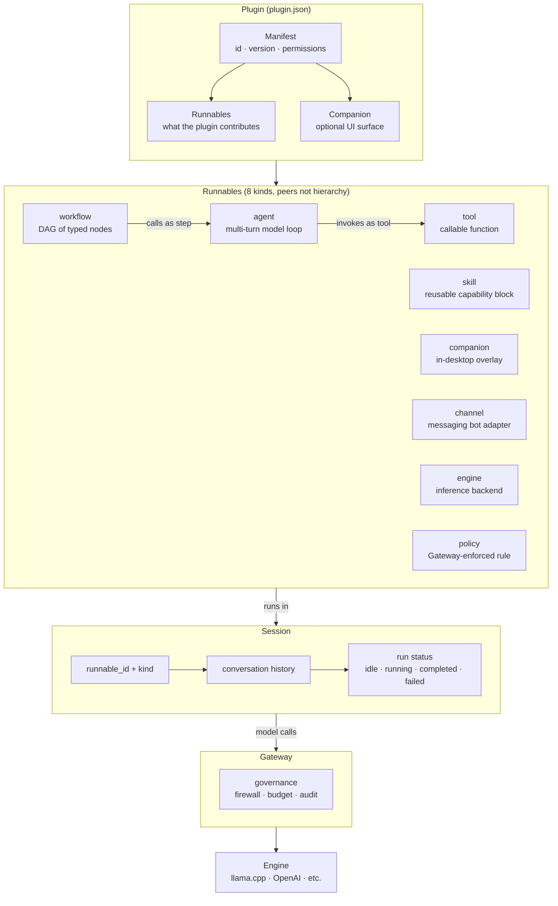
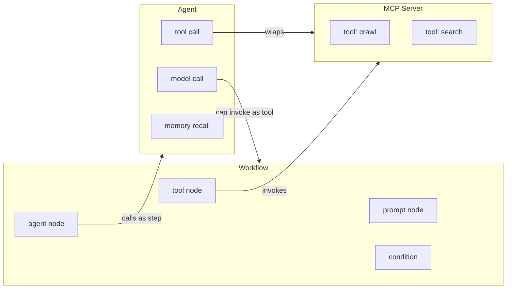
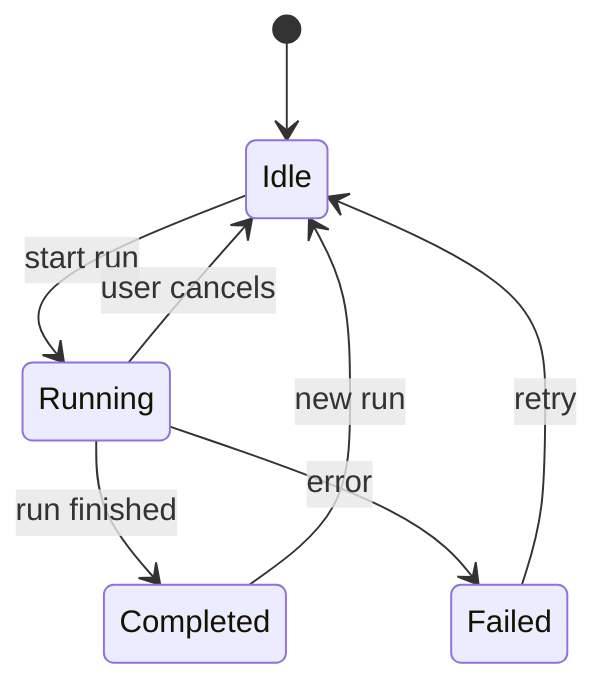
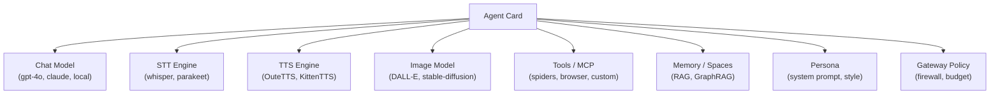

Ryu describes everything it can run with one small vocabulary. Learn these three words and the rest
of the system reads cleanly.

## The object model



## Runnable

A **Runnable** is the one contract that unifies the things Ryu executes. Input goes in, the Runnable
runs, output comes out. Core defines the contract in `apps/core/src/runnable/mod.rs` with a
`RunnableKind` enum of eight variants.

| Kind | What it is |
|---|---|
| `agent` | A multi-turn model loop with swappable model, tools, memory, and persona slots |
| `workflow` | A DAG of typed nodes executed by Core's workflow engine |
| `tool` | A callable function exposed to agents and workflows (wraps an MCP tool) |
| `skill` | An Agent Skill: a reusable, shareable capability block |
| `companion` | An in-desktop overlay or sidebar panel |
| `channel` | A messaging-platform bot adapter (Telegram, Slack, WhatsApp, Discord) |
| `engine` | A model or inference backend binding wired into the Gateway registry |
| `policy` | A Gateway-enforced rule fragment (firewall, PII/DLP, budget) |

The kinds are **peers, not a hierarchy**. An agent can invoke a workflow by exposing it as a named
tool; a workflow can orchestrate agents by calling them as steps. The `RunnableRegistry` activates
Runnables from plugin manifests, with partial-install semantics so one failing Runnable does not abort
the others.

### How Runnables compose



<Callout type="warn">
  Core **validates** all eight kinds, but today it only **activates** three of them from a plugin
  manifest: `agent` (created in the agent store), `workflow` (saved to the workflow engine), and
  `tool` (registered into the MCP registry). The other five — `companion`, `channel`, `engine`,
  `policy`, and `skill` — parse and validate but have **no Core activation handler** yet, so enabling
  a plugin that ships them returns a per-Runnable "no handler" result for those entries
  (`apps/core/src/server/mod.rs`, `build_runnable_registry`). `engine` and `policy` are the Gateway's
  domain; `companion`/`channel`/`skill` activation is not built. See
  [Plugin manifests](/docs/develop/extensions/plugin-json-manifest).
</Callout>

<Callout type="info">
  The TypeScript SDK authors only the four most common kinds (`agent`, `workflow`, `tool`, `skill`);
  the other four are declared directly in `plugin.json`.
</Callout>

## Session

A **Session** owns a run's conversation history and status. It lives in Core
(`apps/core/src/server/conversations.rs`) and binds a conversation to a Runnable.



A session has a `runnable_id`, a `runnable_kind`, and a `status` that is one of `idle`, `running`,
`completed`, or `failed`. Sessions are how Ryu tracks background runs and shows a conversation's run
list. See [Conversations and sessions](/docs/core/conversations-sessions).

## Plugin

A **Plugin** is a `plugin.json` manifest that bundles one or more Runnables plus the permission grants
they need, packaged so Core can install, enable, disable, and update it as a unit. It is modeled on
the plugin-manifest pattern: one declarative file describing everything the plugin contributes.

An agent inside a plugin is a "Pokemon card" with independently swappable slots:



No two cards are alike, and you can change any slot without rebuilding the agent.

See [Plugin manifests](/docs/develop/extensions/plugin-json-manifest) for the full schema and
[The Store](/docs/desktop/user-guide/store) for installing plugins.

## How they connect

```
Plugin (plugin.json)
  bundles -> Runnables (agent, workflow, tool, skill, ...)
                 runs in -> Session (history + status, in Core)
                                model calls -> Gateway -> engine
```

A Plugin is what you install. Its Runnables are what execute. A Session is the live, stateful run of a
Runnable. And every model call a Runnable makes is routed through the Gateway. This is the same
vocabulary the [SDK](/docs/develop/sdk) uses, so code you author with `defineAgent` and friends maps
one-to-one onto what Core runs.

## Related

<Cards>
  <DocCard href="/docs/start-here/architecture/capability-layers" />
  <DocCard href="/docs/start-here/architecture/core-vs-gateway" />
  <DocCard href="/docs/develop/extensions/plugin-json-manifest" />
  <DocCard href="/docs/core/workflows" />
</Cards>
