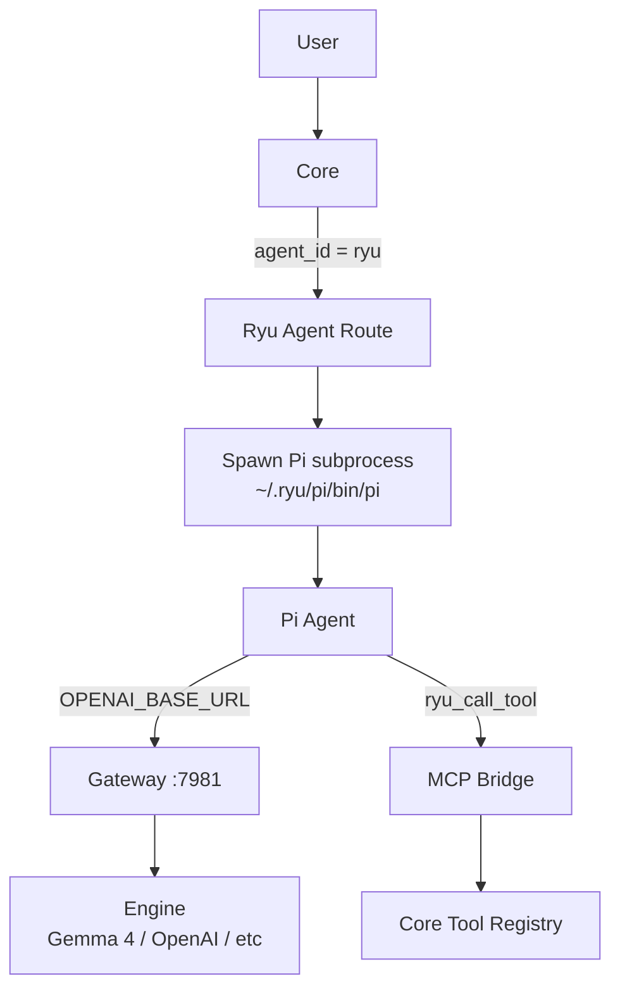

The **Ryu** agent is the default agent installed on every Ryu node. It is Pi (the coding agent from
Earendilworks) wrapped with the Gateway on top — the flagship "car around the engine" demo. When you
send a message in Ryu, the Ryu agent is what handles it unless you explicitly pick a different agent.

## What it is

Ryu is **not** a separate engine. It is a managed configuration of Pi that:

1. **Runs Pi as an ACP subprocess** — the same tool-loop agent that reads files, runs commands, and
   edits code.
2. **Routes every model call through the Gateway** — firewall, budget, evals, and audit apply.
3. **Uses an isolated config directory** — `~/.ryu/pi-agent`, completely separate from any Pi you
   have installed yourself.
4. **Exposes Core's MCP tools to Pi** — via the `ryu-mcp.ts` extension, Pi can call any tool Core
   knows about.
5. **Manages its own Pi binary** — installed at `~/.ryu/pi/`, downloaded and version-checked by
   Core's onboarding.



## How it differs from bare Pi

| Feature | Bare Pi (`acp:pi`) | Ryu agent (`ryu`) |
|---|---|---|
| **Binary** | User's own `pi` on PATH | Managed `~/.ryu/pi/node_modules/.bin/pi` |
| **Config directory** | `~/.pi/agent` | `~/.ryu/pi-agent` (isolated) |
| **Gateway routing** | Opt-in via toggle | **On by default** (`gateway_bypass: false`) |
| **Model calls** | Direct to provider (unless toggled) | Always through Gateway |
| **MCP tools** | Pi's built-in only | Core's full tool registry via `ryu-mcp.ts` |
| **Skills** | Pi's own skill system | Core's skill catalog (progressive disclosure) |
| **Context management** | Pi's own (llama.cpp context-shift) | Ryu's trim/compact layer (opt-in) |
| **Update lifecycle** | Manual | Core manages Pi binary updates |

## The routing chain

When a chat message arrives with `agent_id = "ryu"`, Core follows this path:

1. **`agent_route()`** (`apps/core/src/sidecar/adapters/mod.rs:1202`) matches the `"ryu"` id and
   calls `ryu_agent_route()`.
2. **`ryu_agent_route()`** (line 1115) calls `acp::ryu_pi_acp_cmd()` to build the spawn command.
3. **`ryu_pi_acp_cmd()`** (`acp.rs:2814`):
   - Resolves the managed Pi binary at `~/.ryu/pi/node_modules/.bin/pi`.
   - Calls `pi_config::ensure_managed_defaults()` to write `settings.json` and `models.json`.
   - Injects env vars: `OPENAI_BASE_URL`, `OPENAI_API_KEY`, `PI_CODING_AGENT_DIR`,
     `PI_ACP_PI_COMMAND`, `RYU_MCP_CORE_URL`, `RYU_MCP_AGENT_ID`, `RYU_MCP_CORE_TOKEN`.
   - Returns the full spawn command: `npx -y pi-acp`.
4. The ACP adapter spawns Pi, which reads its isolated config and loads the `ryu-mcp.ts` extension.
5. Pi runs its full tool loop (LLM → tool calls → tool results → continue) via ACP protocol.
6. Core forwards ACP events (text, tool calls, results, usage) to the client.

## The Gateway integration

The Ryu agent is the **only** agent where Gateway routing is on by default. Two mechanisms ensure
model calls traverse the Gateway:

### 1. Environment injection

Core injects `OPENAI_BASE_URL=http://127.0.0.1:7981/v1` and `OPENAI_API_KEY=<gateway-token>` into
the Pi subprocess. Any HTTP client in Pi that reads these env vars will route through the Gateway.

### 2. models.json pinning

Pi does **not** honor `OPENAI_BASE_URL` for its built-in `openai` provider — it uses its own
provider config with `api: "openai-completions"`. So Ryu's config layer writes `models.json` to
pin the `openai` provider at the local Gateway:

```json
{
  "providers": [
    {
      "id": "openai",
      "baseUrl": "http://127.0.0.1:7981/v1",
      "api": "openai-completions",
      "apiKey": "<gateway_token>",
      "models": [
        {
          "id": "gemma-4-E2B-it-Q4_K_M",
          "contextWindow": 128000,
          "maxTokens": 8192
        }
      ]
    }
  ]
}
```

This ensures Pi's LLM calls hit the Gateway regardless of how Pi resolves its provider internally.

### What the Gateway applies

When a model call from the Ryu agent reaches the Gateway, it goes through the full pipeline:

- **Authentication** — validates the gateway token
- **Budget check** — per-key, per-org, per-agent budget enforcement
- **Firewall scan** — PII/DLP, prompt injection detection, custom patterns
- **Model routing** — picks which upstream provider handles the call
- **Cache check** — exact and semantic cache lookup
- **Provider call** — forwards to the upstream (OpenAI, local engine, etc.)
- **Audit** — logs the request for compliance
- **Evals** — inline evaluation (prompt injection detection, PII)

See [Gateway routing](/docs/gateway/routing) for the full pipeline.

## The MCP bridge for Pi

Pi has no in-process MCP bridge — it advertises no MCP-server support. The `ryu-mcp.ts` extension
(loaded from `apps/core/assets/pi-extensions/ryu-mcp.ts`) bridges this gap by registering two tools:

| Tool | What it does |
|---|---|
| `ryu_list_tools` | Discovers available tools via Core's HTTP API (`GET /api/tools/search`) |
| `ryu_call_tool` | Calls any Core tool by name, forwarding to `POST /api/tools/exec/<tool_id>` |

This is what lets the Ryu agent call widget-bearing tools (Apps-SDK / MCP apps), use the self-API,
and access any tool in Core's registry. The bridge also handles widget emission: when a tool returns
structured content in `details.ryuWidget`, Core's ACP handler rebuilds it into widget events for
the desktop.

## Context management

Without Ryu's context-window management, Pi relies on llama.cpp's built-in context-shift. Ryu
never configures `n_keep` for Pi, so `n_keep` defaults to 0 — on overflow, the engine can evict
the **system prompt** along with the oldest turns.

Ryu's context-management layer exists to prevent this. It is **opt-in / off by default**.

### Two modes

| Mode | Setting | What it does |
|---|---|---|
| **Trim** | `context.max-tokens` set, `context.auto-compact` off | A token-budgeted sliding window: keeps the newest turns that fit, always preserving every `system` message and at least the last user turn. Older turns are dropped. |
| **Compact** | `context.max-tokens` set, `context.auto-compact` on | Instead of dropping older turns, sends them to a side model for a concise summary via the Gateway. The summary is injected as a leading `[Earlier conversation summary]` block. |

### Token accounting

Ryu uses a conservative `len / 3.5` character heuristic (no tokenizer, matching Jan AI). Base64
image payloads are not counted — a flat per-image cost of 768 tokens is used instead. A 512-token
reserve is held for downstream skill injection.

### How to enable

Set via the desktop preferences or the Core API:

```bash
# Auto-size to the loaded model's context window
curl -X PUT http://localhost:7980/api/preferences \
  -H 'Content-Type: application/json' \
  -d '{ "key": "context.max-tokens", "value": "auto" }'

# Enable compaction (summarize instead of drop)
curl -X PUT http://localhost:7980/api/preferences \
  -H 'Content-Type: application/json' \
  -d '{ "key": "context.auto-compact", "value": "true" }'
```

See [Pi Engine Internals](/docs/start-here/architecture/pi-engine) for the full details on how
Pi's config, models, and context management work.

## Managed Pi config

Ryu owns three files in `~/.ryu/pi-agent/`:

| File | Contents |
|---|---|
| `settings.json` | `defaultProvider`, `defaultModel`, `defaultThinkingLevel` + Ryu-namespaced keys (`x-ryu-routing`, `x-ryu-provider-routing`, `x-ryu-active-provider`) |
| `models.json` | Custom providers + per-model overrides. The critical piece pins Pi's `openai` provider at the local Gateway. |
| `auth.json` | Per-provider API keys and OAuth subscription tokens. OAuth tokens are proactively refreshed before each turn. |

The Ryu namespaced keys (`x-ryu-*`) survive round-trips because Pi ignores unknown settings keys.

## The managed subscription

The default model for the Ryu agent is `openrouter/auto` via the managed subscription provider
(`managed-openrouter`). This is always Gateway-routed: it reuses the `openai` pin so egress is
governed and metered against the user's Ryu credits. The Gateway maps `openrouter/auto` onto the
OpenRouter provider. No BYOK required.

## Agent card slots

The Ryu agent supports the full "Pokemon card" slot system:

| Slot | Default | Configurable? |
|---|---|---|
| Chat model | `openrouter/auto` (managed) or `gemma-4-E2B-it-Q4_K_M` (local) | Yes — any Gateway-routable model |
| STT engine | Whisper / Parakeet | Yes |
| TTS engine | OuteTTS / Kokoro | Yes |
| Image model | stable-diffusion.cpp | Yes |
| Tools / MCP | Core's full registry | Yes — via MCP registry and plugin system |
| Memory / Spaces | Long-term memory + RAG | Yes |
| Persona | System prompt | Yes |
| Gateway Policy | Default firewall + budget | Yes |

See [Agent cards](/docs/academy/operator/agents-as-cards) for the full slot system.

## When Gateway is off

If you disable Gateway routing for the Ryu agent, it becomes plain Pi: an ACP subprocess calling
its configured provider directly. The MCP bridge still works (tools are still callable), but the
Gateway pipeline (firewall, budget, evals, audit) does not apply to model calls.

```bash
# Disable gateway routing for the Ryu agent
curl -X PUT http://localhost:7980/api/preferences \
  -H 'Content-Type: application/json' \
  -d '{ "key": "agent-gateway-routing", "value": { "ryu": false } }'
```

## Related

<Cards>
  <DocCard href="/docs/start-here/architecture/pi-engine" />
  <DocCard href="/docs/start-here/architecture/acp-agents" />
  <DocCard href="/docs/gateway/routing" />
  <DocCard href="/docs/core/conversations-sessions" />
  <DocCard href="/docs/start-here/architecture/batteries-included" />
</Cards>
