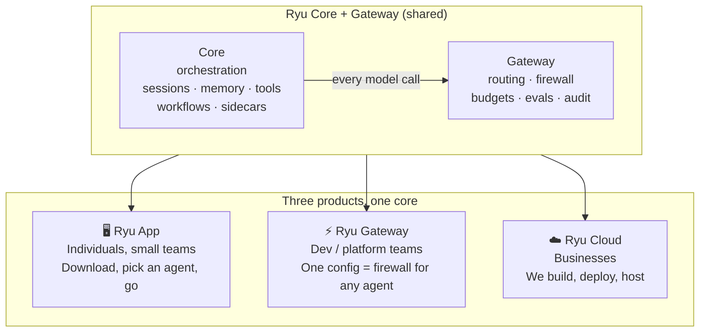
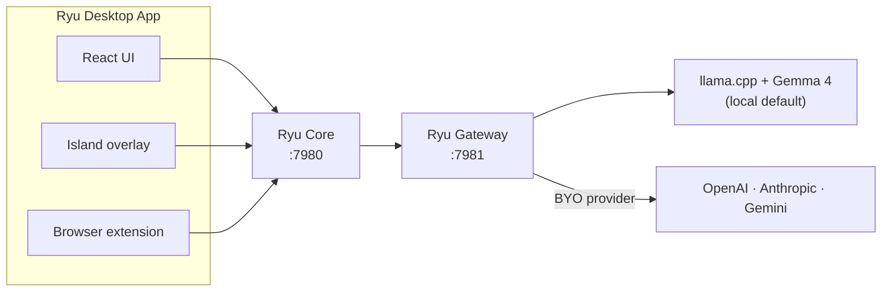
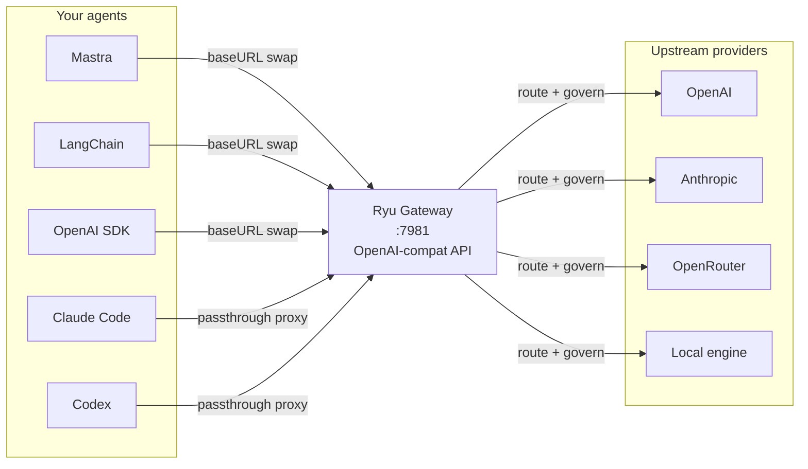
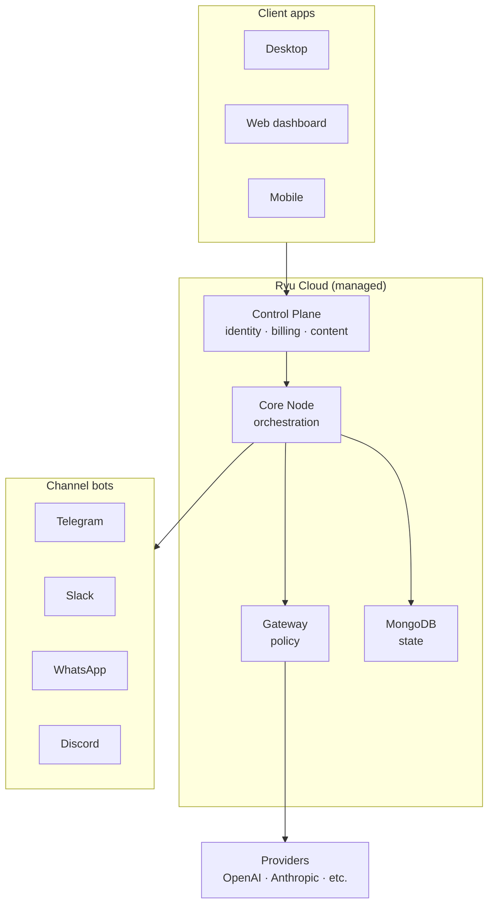

Ryu is one codebase that ships as three products. The same Core and Gateway power all three,
so adopting one never forks you onto a different stack. The products differ in who operates
the infrastructure, not in what the code does.

## The three products



| Product | Audience | What you get | One-line pitch |
|---|---|---|---|
| 🖥️ **Ryu App** | Individuals, small teams | Desktop app + local Core + local Gateway + built-in agent | Download, pick an agent, go |
| ⚡ **Ryu Gateway** | Dev / platform teams | Standalone Gateway + config file + API | One config change puts a firewall in front of any agent |
| ☁️ **Ryu Cloud** | Businesses (SG/SEA SMEs) | Managed hosting + multi-node fleet + channel bots | We audit, build, deploy, and host for you |

## Ryu App

The flagship product. A desktop app (Tauri v2 + React) that spawns a local Core on `:7980`
and a local Gateway on `:7981`. Everything runs on your machine.



**What ships on install:**
- Built-in agent "Ryu" (Pi + Gateway, self-sufficient)
- Local llama.cpp + Gemma 4 chat model
- Local embedding model (nomic-embed-text-v1.5)
- Local STT (whisper.cpp) and TTS (OuteTTS)
- Default reranker (BAAI bge-reranker)
- Default tools (agentbrowser, spider)
- All data stored locally under `~/.ryu/`

**Surfaces:**
- Desktop app (Tauri v2)
- Island companion overlay (Electron)
- Browser extension (WXT)
- TUI terminal client (Bun + OpenTUI)
- CLI terminal client (Rust, deprecated)
- Mobile app (Expo/RN, partial)
- Raycast extension

## Ryu Gateway

A standalone Gateway that sits in front of any agent or framework. You run it yourself
(or we host it), point your agents at its base URL, and every model call runs through
Ryu's firewall, PII/DLP, budgets, evals, and audit.



**Quick start:**
```bash
# 1. Create gateway.toml
cat > gateway.toml << 'EOF'
[auth]
require_auth = true

[[auth.api_keys]]
key = "ryu-sk-my-secret"
name = "my-app"
EOF

# 2. Start the Gateway
cargo run --manifest-path apps/gateway/Cargo.toml -- --config gateway.toml

# 3. Point any agent at it
# baseURL = http://127.0.0.1:7981/v1
# apiKey = ryu-sk-my-secret
```

**What it governs:**
- Model routing (smart routing, fallback, eval-driven)
- Firewall (PII/DLP, prompt injection, moderation)
- Budgets (per-user, per-agent, per-session token caps)
- Rate limiting and circuit breaking
- Exact and semantic caching
- Evals and audit trail
- Tool governance (search, allowlist, exec budget)

## Ryu Cloud

Managed hosting for businesses. We run the infrastructure, you use the agents.



**What Ryu Cloud adds:**
- Managed identity and billing (Better Auth + Polar)
- Multi-node fleet with cross-device sync
- Node selection (prefer reachable remote, else local)
- Channel bots (Telegram, Slack, WhatsApp, Discord)
- Notion-backed content and blog
- Web dashboard for billing and settings

## How they share code

The key insight: **the code is the same**. The products differ in what runs where, not in what
the code does.

| Layer | Ryu App | Ryu Gateway | Ryu Cloud |
|---|---|---|---|
| Core | Local process | Not needed | Managed node |
| Gateway | Local sidecar | Standalone process | Managed node |
| Desktop | Local Tauri app | — | Remote web app |
| Server | Local (optional) | — | Managed (Better Auth) |
| Database | Local SQLite | — | Managed MongoDB |
| Agents | Local subprocess | BYO | Managed + BYO |
| Billing | — | — | Polar integration |

The same `apps/core` and `apps/gateway` Rust binaries run in all three contexts. The desktop
app spawns them as sidecars; Ryu Cloud runs them as services; Ryu Gateway runs the Gateway
standalone.

## The business shape

The business model is **open core plus managed cloud** (the Vercel / Supabase shape):

- **Core + Gateway** are open-source (Apache-2.0 / AGPL-3.0) and self-hostable
- **Desktop + Web + Server** are proprietary (the UX and identity layer)
- **Ryu Cloud** is the managed offering that funds development

This means:
- Anyone can self-host the orchestration and control plane
- The product surface (desktop, web, mobile) is closed
- The moat (Gateway) is AGPL, preventing proprietary forks from reselling it
- The plugin runtime is in OSS Core, so the closed desktop stays extensible

See [Open Core](/docs/start-here/architecture/open-core) for the full licensing boundary.

## Which product should I use?

| If you are... | Use... | Why |
|---|---|---|
| An individual who wants AI agents | Ryu App | Download and go, no setup |
| A developer with existing agents | Ryu Gateway | Point your agents at it, get governance |
| A team that wants managed agents | Ryu Cloud | We handle infrastructure |
| A business in SG/SEA | Ryu Cloud | Full-service: build, deploy, host |
| A plugin author | Ryu App or self-hosted Core | Plugins live in OSS Core |
| An enterprise wanting control | Ryu Gateway + self-hosted | Full control, your infrastructure |

## Related

<Cards>
  <DocCard href="/docs/start-here/architecture/core-vs-gateway" />
  <DocCard href="/docs/start-here/architecture/open-core" />
  <DocCard href="/docs/start-here/architecture/batteries-included" />
  <DocCard href="/docs/gateway/gateway-for-any-agent" />
</Cards>
