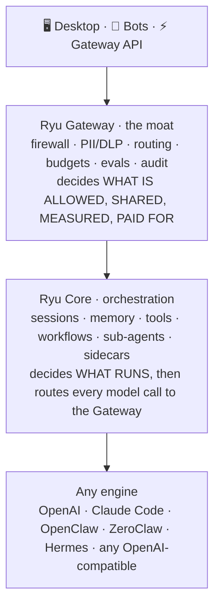

Agents are powerful. Using them shouldn't be. The engines already exist - OpenAI, Claude Code,
OpenClaw, ZeroClaw, Hermes, any OpenAI-compatible runtime. Ryu is the whole car built around
them: end-to-end infrastructure for AI agents.

The thesis is one sentence. Agents are commoditized; the orchestration and control layer around
them is not. The engines are interchangeable parts. What is durable is the layer that decides
what models an agent can reach, what tools it can use, what data is safe to send, what it costs,
how it is governed, and how good its outputs are. Ryu owns that layer.

## The one-line moat: nothing hardcoded, everything swappable

Ryu's wedge over the model vendors (OpenAI, Anthropic) and over every agent harness (Claude
Code, Codex, Pi, OpenClaw, LangChain, Mastra) is that we lock you to nothing. They own a model
and a harness. Ryu sits *above* all of them as the orchestration and control layer - the car
around any engine.

Every layer is a swappable default, never a lock:

| Layer | Default on install | Swap to |
|---|---|---|
| Chat engine and model | llama.cpp + Gemma 4 (local) | Ollama, vLLM, SGLang, MLX, any OpenAI-compatible, or a hosted provider |
| Embedding | `nomic-embed-text-v1.5` (GGUF, local) | any registry embedder |
| Reranker | BAAI `bge-reranker` | any registered reranker |
| RAG strategy | vector (sqlite-vec) | vector and GraphRAG |
| Agent engine | "Ryu" (Pi + the Gateway on top) | Claude Code, Codex, Gemini CLI, bare Pi, OpenClaw, Hermes, any ACP agent |
| TTS / STT | OuteTTS, whisper.cpp / parakeet | KittenTTS, Pocket TTS, any TTS-sidecar backend |
| Image generation | stable-diffusion.cpp | any compatible engine |
| Sandbox backend | wasmtime (ephemeral) | Docker-detect (future) |
| Marketplace source | first-party + HF / skills.sh / MCP registry | any user-added `CatalogSource` |

The rule that produces this, in code: ship sensible defaults so it runs the moment you install,
but never hardcode a model, provider, or strategy. Everything routes through one swappable config
or registry. `DEFAULT_AGENT_ID` is `"ryu"`, the default chat model is overridable via the
`local-chat-model` preference, and even the data folder itself is relocatable
(see [Data and storage](/docs/desktop/user-guide/data-and-storage)). This is `BYO everything,
zero lock-in` made literal, and it is the selling point.

## Orchestration above engines, not another engine

Ryu does not reimplement the agent loop. It wraps whatever engine you picked and hands every
model call to the Gateway for governance. The flow is the same on every request:

The single most important design rule, Core versus Gateway, falls straight out of this picture:
if code decides *what runs* it is Core; if code decides *what is allowed, shared, measured, or
paid for* it is Gateway. That split is the spine of the whole system and has its own page.

<Cards>
  <DocCard href="/docs/start-here/architecture/core-vs-gateway" />
  <DocCard href="/docs/start-here/architecture/runnable-model" />
</Cards>

## The five non-negotiable principles

Every change in Ryu is measured against these. They are why the architecture looks the way it does.

| Principle | What it means |
|---|---|
| **Orchestration-first** | Wrap whatever engine the user picked. Never reimplement the agent loop. |
| **Local-first and headless-first** | Core runs with no UI, no cloud, and no streaming required. It is a real local backend, not a thin client. |
| **Modular** | Everything beyond the gateway kernel is opt-in via config. |
| **BYO everything** | BYOA (agent), BYOK (key), BYOS (subscription). Zero lock-in. |
| **Encrypted by default, no telemetry by default** | Your data stays yours. Conversations and memory are sealed at rest; nothing phones home unless you opt in. |

<Callout type="info">
The local-first principle is load-bearing for the moat, not just a nicety. On install, with no
API key and no setup, Ryu works immediately and fully local. See
[Batteries-included defaults](/docs/start-here/architecture/batteries-included) for what ships
out of the box, all of it swappable.
</Callout>

## Three products, one Rust core

The same Core and Gateway power three offers, so adopting one never forks you onto a different stack:

| Product | Audience | One-line pitch |
|---|---|---|
| 🖥️ **Ryu App** | Individuals, small teams | Download, pick an agent, go |
| ⚡ **Ryu Gateway** | Dev and platform teams | One config change puts a firewall in front of any agent they already run |
| ☁️ **Ryu Cloud** | Businesses | We audit, build, deploy, and host; ship bots into Telegram, Slack, WhatsApp, and Discord |

The business shape is open core plus managed cloud. The Rust `core` and `gateway` are
open-source and self-hostable, because trust matters for the layer that governs every call; the
desktop, web, and backend are the closed UX and identity layer. See
[Core vs Gateway](/docs/start-here/architecture/core-vs-gateway) for where the boundary sits and
why it is drawn there.

<Callout type="warn">
Ryu is a moving target. Some surfaces described across these docs are opt-in, off by default,
Windows-first, or built but not yet live-verified against a running node. Each page carries its
own maturity caveats - read them before you rely on a feature, and treat a closed issue as a
claim, not proof.
</Callout>
