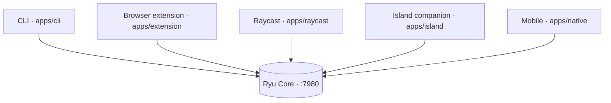

The desktop app is the primary surface, but it is not the only one. Ryu ships five other clients,
and every one of them talks to the **same Core** (the local backend on `:7980`, reachable through
the active node). They share the same conversations, the same agents, and the same Gateway routing,
so switching surfaces never switches context: a chat you start in the CLI is the same conversation
you open in the desktop app.

## At a glance

| Client | Path | Stack | Reaches Core | Maturity |
|---|---|---|---|---|
| CLI | `apps/cli` | Rust / ratatui | `/api/chat/stream` + list endpoints | Working (live needs running Core + TTY) |
| Browser extension | `apps/extension` | WXT / TS | background-worker fetch bridge | Partial (new-tab home + smart bar shipped) |
| Raycast | `apps/raycast` | `ray` CLI / TS | direct (no CORS) | Built (source syntax-verified) |
| Island companion | `apps/island` | Electron | mini chat + command transport | Built (live summon unverified) |
| Mobile | `apps/native` | Expo / RN | `${activeNode.url}/api/chat/stream` | Partial (chat + ~10 drawer screens) |

## CLI

The CLI (`apps/cli`) is a Rust [ratatui](https://ratatui.rs) terminal UI near desktop parity.

- **Chat** routes through Core's `/api/chat/stream` with a minted conversation id
  (`apps/cli/src/chat.rs`, `apps/cli/src/main.rs`), so chat-side features work against a persisted
  conversation: `/goal`, `/double-check`, `/model`, `/team`, `/sessions`, and `/btw`.
- A fuzzy **command palette** opens with `Ctrl+P` (`apps/cli/src/ui.rs`), the terminal analog of the
  desktop Cmd+K.
- Seven data-driven **list tabs** read live from Core through one shared fetcher
  (`api::fetch_feature_list` + `render_feature_tab` over a single `SimpleListTab`):

  | Tab | Core endpoint |
  |---|---|
  | Models | `/api/models/catalog` |
  | Skills | `/api/skills/catalog` |
  | Tools | `/api/tools/search` |
  | Monitors | `/api/monitors` |
  | Teams | `/api/teams` |
  | Meetings | `/api/meetings` |
  | Recipes | `/api/recipes` |

- It also covers **device login**, sidecar/engine/app/gateway/workflow/space/schedule management, the
  GitOps `apply` / `diff` / `config` commands, and **LAN node auto-discovery**
  (`apps/cli/src/nodes.rs`).

<Callout type="info">
  The CLI builds green (`cargo build`), but live round-trips need a running Core and a TTY. The
  parity matrix and the deferred set (voice input, workflow canvas editing, marketplace buy, memory
  and settings tabs, permission-mode and effort pickers) live in `docs/cli-desktop-parity.md`.
</Callout>

## Browser extension

The browser extension (`apps/extension`) is a [WXT](https://wxt.dev) build with a popup, a
dashboard, and in-page actions.

- A **Dia-style new-tab home** (`apps/extension/entrypoints/newtab`) puts a smart bar, recent
  conversations, and an agent picker on every new tab.
- The **omnibox keyword** `ryu` routes address-bar input through the shared pure smart-bar engine
  (`apps/extension/lib/smart-bar.ts`): an AI prompt opens the dashboard chat, a navigation or search
  query opens the URL.
- In-page browser features add **Ask about a selection**, **quick-ask on a selection**, and **Save
  page to a Ryu Space**, plus a bridge that mirrors page context to the Island.
- All Core calls go through a **background-worker fetch bridge** rather than from the page directly,
  because Core's CORS is a fixed allowlist that does not include the extension origin.

<Callout type="warn">
  The extension builds, but many surfaces are still "coming soon" and live round-trips need a running
  Core. The new-tab home, smart bar, and the browser features are shipped but not live-verified.
</Callout>

## Raycast extension

The Raycast extension (`apps/raycast`) is a `ray` extension for macOS and Windows that pipes Ryu into
an existing Raycast setup. It hits Core **directly**: Raycast commands run in a Node context with no
browser Origin header, so CORS is a non-issue. The base URL, optional bearer token, and default agent
come from the extension preferences, defaulting to `http://localhost:7980`.

- **Ask Ryu** answers a one-shot question, streamed into a Detail view.
- **Chat with Ryu** is a multi-turn List view.
- **Search Conversations** browses past conversations.

The extension is **fenced out of the Bun/Turbo workspace** (`!apps/raycast`) and carries its own
`ray` toolchain.

<Callout type="warn">
  The Raycast source is syntax-verified, but `ray build` and the runtime have not been exercised here:
  they need the user's local Raycast install.
</Callout>

## Island companion

The Island (`apps/island`) is an Electron dynamic-island overlay that also **hosts the command bar**
(the former standalone `apps/command` launcher was merged in).

- It runs **Shadow** context monitoring (`:3030`) plus a **local-model proactive engine** that
  surfaces suggestion chips, and a **mini chat** onto Core (`:7980`).
- A global hotkey expands the resting pill into a **command palette / mini-chat** (the `command`
  expanded view) over a `window.island` transport (`apps/island/src/renderer/command-transport.ts`),
  reusing the `@ryu/blocks` command-bar shell and the island's `island-agents` voice-agent pref.
- Every capability the companion uses is behind a **per-capability consent gate**, so nothing reads
  your screen or audio until you allow it. Consent mirrors the Core `island-consent` pref, so a
  desktop grant opens the Shadow gate without a first-run card.

<Callout type="warn">
  The Island is built, but its live hotkey summon, focus handling, and context loop are unverified:
  they need a real display to exercise. Shadow context capture is Windows-first.
</Callout>

## Mobile

The mobile app (`apps/native`) is an [Expo](https://expo.dev) React Native build. Like every other
client it is a thin GUI over the **same Core HTTP API** reached through the active node, not a
separate backend.

- **Chat** POSTs `${activeNode.url}/api/chat/stream` with the selected `agent_id`
  (`apps/native/app/(drawer)/ai.tsx`), and supports the `/btw` side question
  (`apps/native/lib/btw.ts`, posted to Core's `/api/btw`).
- A **node selector** (`apps/native/components/node-selector.tsx` + `lib/node-store.ts`) picks which
  Core node every request targets, so the phone can talk to a local or a remote node.
- Roughly **ten drawer screens** are thin loaders over Core endpoints, built on one shared
  `ListScreen` scaffold (`apps/native/components/list-screen.tsx`): agents, skills, models, services,
  workflows, schedules, spaces, tools, apps, and meetings (plus pre-existing ai, marketplace, and
  monitors). Mobile registers Expo push tokens for monitor alerts via
  `apps/native/hooks/usePushRegistration.ts`.
- The shared client layer lives in the workspace package **`packages/core-client`** (a
  platform-agnostic `client.ts` plus Core API modules), which mobile adapts to its node store through
  `apps/native/lib/api-target.ts`. This is the single source that keeps mobile and desktop in sync.

<Callout type="warn">
  Mobile is partial. Chat and the drawer screens work against Core, but full desktop parity is
  pending (see `docs/mobile-parity.md`), and several screens need `bunx expo install` plus a device
  build to exercise. On-device inference (Cactus Compute) is blocked upstream and not wired.
</Callout>

## See also

<Cards>
  <DocCard href="/docs/start-here/architecture/core-vs-gateway" />
  <DocCard href="/docs/core/conversations-sessions" />
  <DocCard href="/docs/core/node-and-presence" />
  <DocCard href="/docs/using-ryu/deep-links" />
</Cards>
